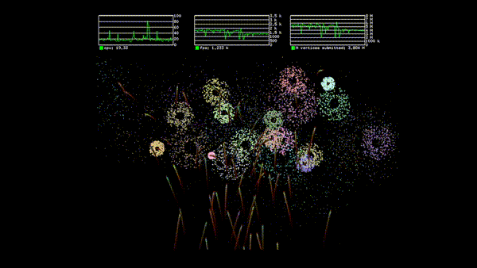

# rust-firework

Rust application for rendering fireworks (OpenGL + Audio)

## 🚀 Présentation

`rust-firework` est une application écrite en Rust qui génère des feux
d'artifice visuels via un contexte OpenGL, et joue un fond sonore via
cpal. L'objectif est de combiner rendu graphique dynamique et audio en
temps réel pour créer une expérience immersive.

## 🎥 Démo

<!-- Option fallback avec miniature -->
[](doc/firework-demo.mp4)

## 🎯 Objectifs

-   Rendu 2D/3D de particules simulant des feux d'artifice
-   Intégration audio synchronisée via la bibliothèque `cpal`
-   Code propre, extensible, basé sur Rust
-   Terrain d'expérimentation pour shaders, blending, effets visuels et
    audio

## 🧩 Fonctionnalités

-   Initialisation d'une fenêtre + contexte OpenGL
-   Système de particules complet : lancement, explosion, dispersion
-   Effets visuels (gravité, couleurs, modificateurs, bruit, etc.)
-   Lecture audio (musique ou sons d'explosion)
-   Paramétrage simple du comportement des feux d'artifice

## 🛠 Prérequis

-   Rust stable (1.x ou supérieur)
-   Système compatible OpenGL
-   Support audio compatible (via `cpal`)
-   `cargo` pour la compilation

## 📥 Installation & compilation

``` bash
git clone https://github.com/yoyonel/rust-firework.git
cd rust-firework
cargo build --release
cargo run --release
```

Via Docker :

``` bash
docker build -t rust-firework .
docker run --rm -it rust-firework
```

## 🎛 Configuration

Les fichiers multimédia se trouvent dans `assets/`.
Les paramètres modifiables incluent :
- nombre de particules
- vitesse initiale
- gravité
- durée de vie
- couleur
- volume audio

## ⌨️ Commandes & Contrôles

### Raccourcis Clavier

| Touche | Action |
|--------|--------|
| `R` | Recharger la configuration physique (`physic.toml`) |
| `S` | Recharger les shaders à chaud |
| `F11` | Basculer en plein écran |
| `Echap` | Quitter l'application |
| `` ` `` (Grave) | Ouvrir/Fermer la console de commande |

### Commandes Console

La console permet d'interagir avec le moteur en temps réel.

**Audio**
- `audio.list_devices` : Liste les périphériques audio disponibles
- `audio.set_device <index>` : Change le périphérique de sortie
- `audio.set_volume <0.0-1.0>` : Ajuste le volume global

**Physique**
- `physic.set_gravity <x> <y>` : Modifie le vecteur de gravité

**Rendu**
- `renderer.reload_shaders` : Recharge les fichiers shaders (identique à `S`)

## 📁 Structure du projet

    rust-firework/
    ├── assets/             # textures, sons, médias
    ├── doc/                # documentation
    ├── src/                # code source Rust
    ├── tests/              # tests unitaires / intégration
    ├── Dockerfile          # build conteneurisé
    ├── Makefile            # commandes utilitaires
    ├── Cargo.toml          # configuration Rust
    └── README.md

## 🧪 Utilisation & extension

-   Ajouter de nouveaux effets de particules : créer un module, définir
    les règles et l'intégrer au pipeline graphique.
-   Modifier l'audio ou ajouter une synchronisation explosion → son.
-   Améliorer le rendu visuel en modifiant shaders, caméra, o
    post-processing.
-   Tester la prise en charge multiplateforme (Linux/Windows/Mac).

## 📝 Contribution

Toute contribution est la bienvenue :
- signaler un bug via une issue
- envoyer une pull request pour une fonctionnalité
- respecter `cargo fmt` et `clippy`
- ajouter des tests si nécessaire

## 📄 Licence

Projet sous licence MIT. Voir le fichier `LICENSE` pour plus de détails.

## 🎉 Remerciements

Merci aux personnes testant ou contribuant au projet. Tout retour est
bienvenu pour améliorer les effets visuels et audio.