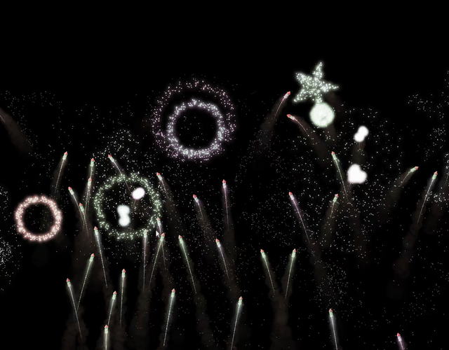

# rust-firework

Rust application for rendering fireworks (OpenGL + Audio)

[](https://github.com/yoyonel/rust-firework/actions/workflows/ci.yml)
[](https://github.com/yoyonel/rust-firework/actions/workflows/integration.yml)
[](https://github.com/yoyonel/rust-firework/actions/workflows/deploy_docs.yml)
[](https://yoyonel.github.io/rust-firework/)
[](https://opensource.org/licenses/MIT)

## 🚀 Présentation

`rust-firework` est une application écrite en Rust qui génère des feux d'artifice visuels via un contexte OpenGL, et joue un fond sonore via `cpal`. L'objectif est de combiner rendu graphique dynamique et audio en temps réel pour créer une expérience immersive.

La documentation interactive complète (profilage mémoire, analyses de performance, manuel du renderer, spécifications Doppler, etc.) est disponible sur la **[GitHub Page du Projet](https://yoyonel.github.io/rust-firework/)**.

## 🎥 Démo

[](doc/firework-demo.mp4)

### 💨 Traînée de Fumée & Érosion Alpha (Dissolve GPU)



## 🎯 Objectifs

-   Rendu 2D/3D de particules simulant des feux d'artifice
-   Intégration audio synchronisée via la bibliothèque `cpal`
-   Code propre, extensible, basé sur Rust
-   Terrain d'expérimentation pour shaders, blending, effets visuels et
    audio

## 🧩 Fonctionnalités

-   Initialisation d'une fenêtre + contexte OpenGL (rendu AZDO, buffers persistants, texture arrays, UBO)
-   Système de particules complet : lancement, explosion, dispersion
-   Effets visuels (gravité, couleurs, modificateurs, bruit, rendu de cercles instanciés GPU, etc.)
-   Moteur Audio 3D temps réel (CPAL, zéro-allocation dans le thread audio) :
    - Modèle d'atténuation de distance (Inverse-Distance Roll-off : volume max à 50px, fondu jusqu'à 2000px)
    - Vol de voix prioritaire (Voice Stealing) basé sur le volume pré-atténué et le type de son (jusqu'à 128 voix)
    - Panning binaural ITD/ILD & Bus Spatial 2D (Ambisonics 2D) avec Réverbération Spatiale
    - Synchronisation dynamique de la position de l'auditeur au sol (0.5w, 0) via `AtomicVec2` lock-free
    - Throttling Doppler à 144 Hz pour éliminer le bruit de fermeture (*zipper noise*)
-   Outils de Diagnostic Audio & Télémétrie en temps réel :
    - Moniteur de diagnostic ImGui avec suivi des latences (Transit & Render-to-Start) et détection des drops
    - Superposition graphique du Listener (icône casque vert, zones de distance bleue/orange)
-   Scène de Stress-Test Audio interactive (128 à 1024 sources virtuelles) avec rendu GPU d'orbites instanciées
-   Paramétrage simple du comportement des feux d'artifice et recharge à chaud (shaders, config)

## 🛠 Prérequis

-   Rust stable (1.x ou supérieur)
-   Système compatible OpenGL 4.5
-   Support audio compatible (via `cpal` / PipeWire / ALSA / PulseAudio)
-   `cargo` ou `task` pour la compilation

## 📥 Installation & compilation

``` bash
git clone https://github.com/yoyonel/rust-firework.git
cd rust-firework
cargo build --release
cargo run --release
```

Exécuter la scène de stress-test audio (128+ sources virtuelles) :

``` bash
task run-audio-stress -- 256
```

Via Docker :

``` bash
docker build -t rust-firework .
docker run --rm -it rust-firework
```

## 🎛 Configuration

Les fichiers de configuration se trouvent dans `assets/config/`.
Les paramètres modifiables incluent :
- `physic.toml` : nombre de particules, vitesse initiale, gravité, durée de vie, forme d'explosion
- `audio.toml` : volume audio, nombre max de voix (128), réverbération spatiale, bus spatial 2D, atténuation
- `renderer.toml` : bloom, tone mapping, options d'affichage

## ⌨️ Commandes & Contrôles

### Raccourcis Clavier

| Touche | Action |
|--------|--------|
| `R` | Recharger la configuration physique (`physic.toml`) |
| `S` | Recharger les shaders à chaud |
| `F3` | Afficher/Masquer le Moniteur de Diagnostic Audio & Overlay |
| `F4` | Ouvrir/Fermer le Panneau de Contrôle GUI ImGui (Réglages Audio, Physique, Rendu) |
| `F11` | Basculer en plein écran |
| `Echap` | Quitter l'application |
| `` ` `` (Grave) / `F1` | Ouvrir/Fermer la console de commande |

### 🎛️ Panneau de Contrôle GUI ImGui (`F4`)

Pressez **`F4`** pour ouvrir la fenêtre interactive ImGui regroupant l'ensemble des réglages du moteur :
- **Onglet 1 (Audio)** : Mute/Unmute avec statut en direct, curseur & presets de réverbération spatiale (`audio.reverb_wet`), matrice interactive des 11 effets DSP, suivi F3 et scène de stress-test.
- **Onglet 2 (Physique)** : Synchronisation & application à chaud (`physic.apply`), capacité de simulation, paramètres de spawn & forces, formes d'explosion & presets multiples (`Heart`, `Star`, `Smiley`, `Note`, `Ring`) avec réglage individuel des poids, échelles (px), temps de vol (s), réinitialisations dédiées (`[Reset W]`, `[Reset Scale]`, etc.) et suppression ciblée (`[X Delete]`).
- **Onglet 3 (Smoke & Erosion)** : Traînée de fumée volumétrique avec effet d'Érosion Alpha (Dissolve GPU par masque de bruit Perlin), couture incandescente (*Burn Seam*), interrupteur `smoke_erosion_enabled`, vitesse d'érosion `smoke_erosion_scale`, nuancier de couleur incandescente, presets rapides (*Fire & Ember*, *Plasma Blue*, *Volumetric Cloud*, *Toxic Plasma*) et canevas de prévisualisation ISO GPU FBO avec contrôles de Viewport 3D (Pan X/Y Clic-Milieu, Rotation Z Clic-Droit, Zoom Molette isolée).
- **Onglet 4 (Renderer & Post-FX)** : Rechargement des shaders, sélecteur de Tone Mapping (`Reinhard`, `ACES`, `AgX`, `Khronos PBR`, `Uncharted 2`), mode grille de comparaison 2x3 et contrôle du Bloom (Intensité, Itérations, Sous-échantillonnage 1x/2x/4x, méthode Gaussian vs Kawase).
- **Onglet 5 (Console Commands)** : Catalogue de toutes les commandes inscrites avec lecture des valeurs courantes.
- **Persistence de Session (`assets/config/gui_session.toml`)** : Sauvegarde et restauration automatique de l'état du GUI, des filtres, du zoom/viewport, des moniteurs F3 et des paramètres physiques & audio à la relance.

Pour plus de détails, consultez la **[Spécification du Système de Fumée & Érosion Alpha](doc/20260730_instanced_smoke_trail_system_and_dynamics.md)** ainsi que la **[Spécification du Panneau de Contrôle GUI ImGui & Persistence](doc/20260729_imgui_control_panel_and_session_persistence.md)**.

### Commandes Console

La console permet d'interagir avec le moteur en temps réel.

**Audio**
- `audio.list_devices` : Liste les périphériques audio disponibles
- `audio.set_device <index>` : Change le périphérique de sortie
- `audio.set_volume <0.0-1.0>` : Ajuste le volume global
- `audio.mute` / `audio.unmute` : Coupe ou rétablit le son
- `audio.fx <effect> <on|off>` : Active/désactive un effet DSP (`binaural`, `panning`, `distance_atten`, `lowpass`, `doppler`, `fade`, `gain_lerp`, `spatial_bus`, `spatial_reverb`)
- `audio.fx_all <on|off>` : Active/désactive tous les effets DSP
- `audio.fx_status` : Affiche l'état de tous les effets DSP
- `audio.reverb_wet <0.0-1.0>` : Ajuste le niveau de mix de la réverbération spatiale

**Physique**
- `physic.set_gravity <x> <y>` : Modifie le vecteur de gravité
- `physic.config.reload` / `physic.config.save` : Recharge ou sauvegarde la configuration physique

**Rendu**
- `renderer.reload_shaders` : Recharge les fichiers shaders (identique à `S`)
- `renderer.bloom.enable` / `renderer.bloom.disable` : Active/désactive l'effet Bloom
- `renderer.tonemapping <method>` : Change l'opérateur de Tone Mapping (`reinhard`, `aces`, `filmic`, `uncharted2`)

## 📁 Structure du projet

    rust-firework/
    ├── assets/             # textures, sons, médias
    ├── doc/                # documentation
    ├── src/                # code source Rust
    ├── tests/              # tests unitaires / intégration
    ├── Dockerfile          # build conteneurisé
    ├── Makefile            # commandes utilitaires
    ├── Cargo.toml          # configuration Rust
    └── README.md

## 🧪 Utilisation & extension

-   Ajouter de nouveaux effets de particules : créer un module, définir
    les règles et l'intégrer au pipeline graphique.
-   Modifier l'audio ou ajouter une synchronisation explosion → son.
-   Améliorer le rendu visuel en modifiant shaders, caméra, o
    post-processing.
-   Tester la prise en charge multiplateforme (Linux/Windows/Mac).

## 📝 Contribution

Toute contribution est la bienvenue :
- signaler un bug via une issue
- envoyer une pull request pour une fonctionnalité
- respecter `cargo fmt` et `clippy`
- ajouter des tests si nécessaire

## 📄 Licence

Projet sous licence MIT. Voir le fichier `LICENSE` pour plus de détails.

## 🎉 Remerciements

Merci aux personnes testant ou contribuant au projet. Tout retour est
bienvenu pour améliorer les effets visuels et audio.
