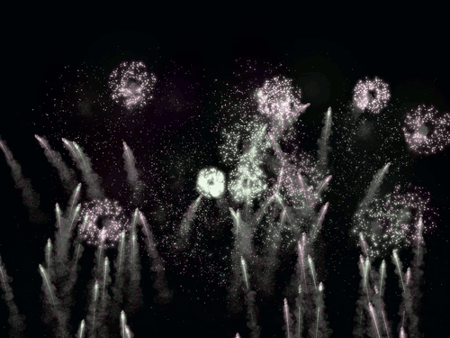
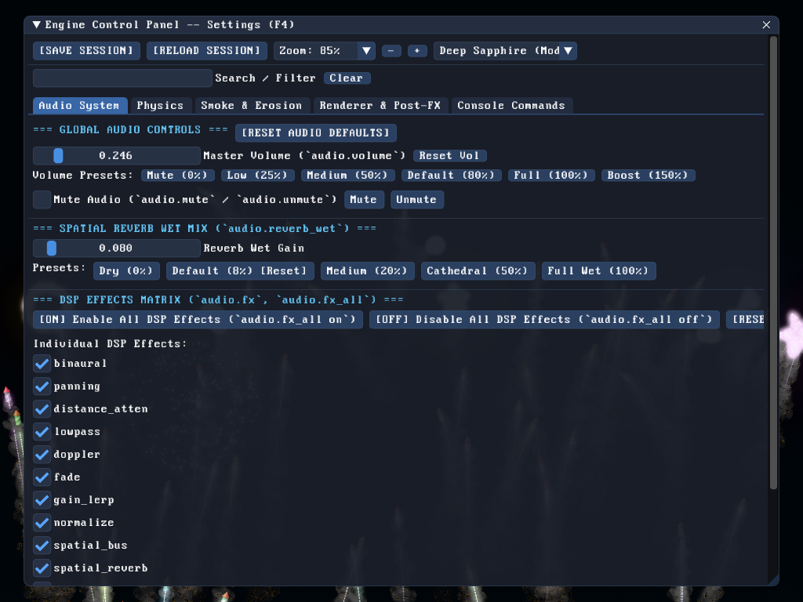
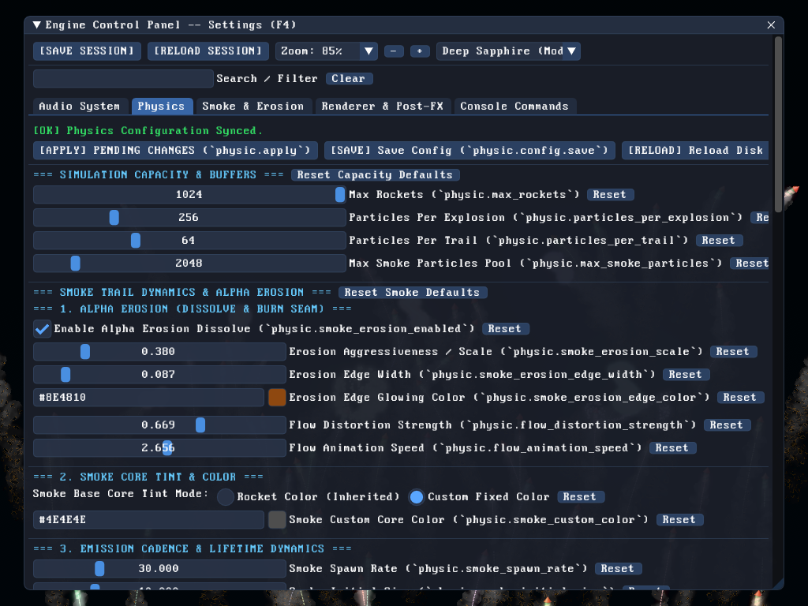
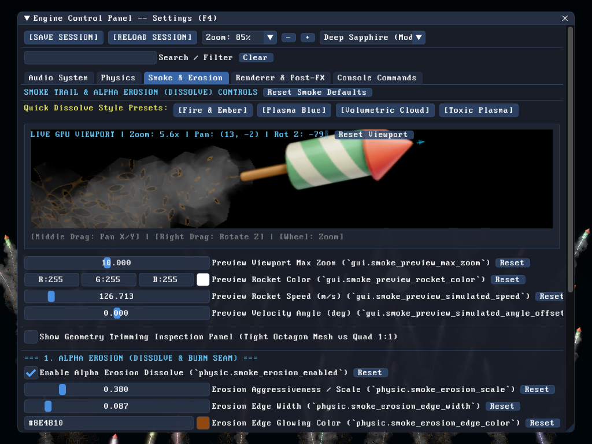
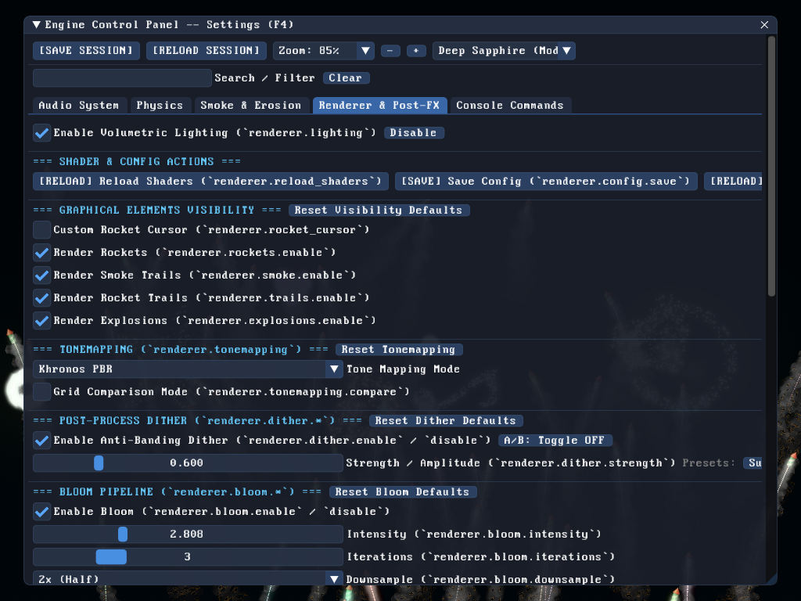
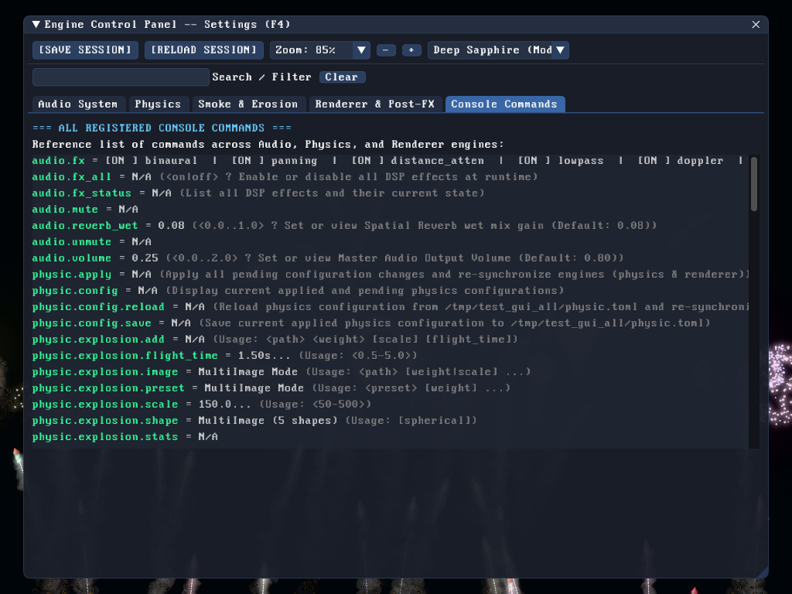
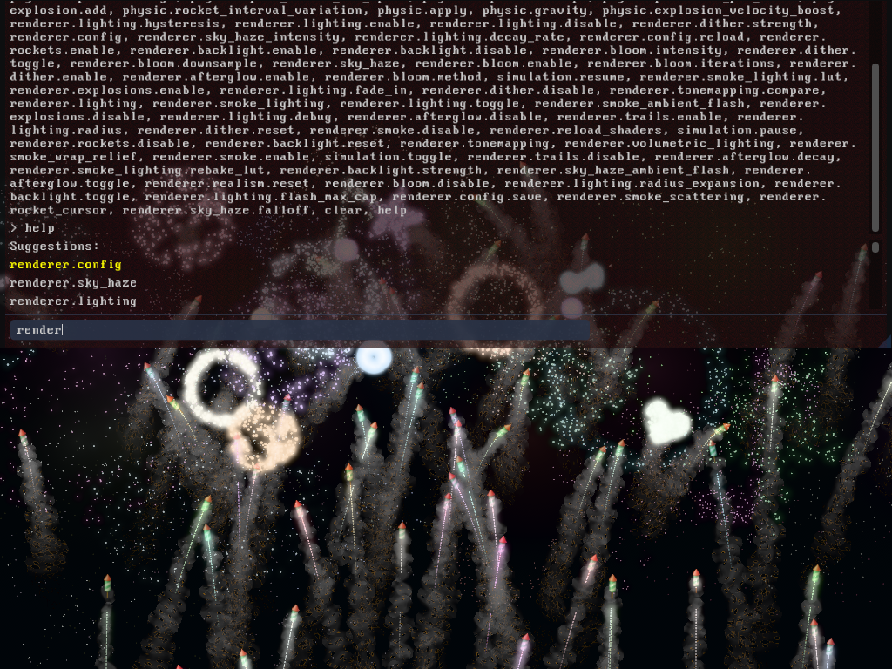

# rust-firework

Rust application for rendering fireworks (OpenGL + Audio)

[](https://github.com/yoyonel/rust-firework/actions/workflows/ci.yml)
[](https://github.com/yoyonel/rust-firework/actions/workflows/integration.yml)
[](https://github.com/yoyonel/rust-firework/actions/workflows/deploy_docs.yml)
[](https://yoyonel.github.io/rust-firework/)
[](https://opensource.org/licenses/MIT)

## 🚀 Présentation

`rust-firework` est une application écrite en Rust qui génère des feux d'artifice visuels via un contexte OpenGL, et joue un fond sonore via `cpal`. L'objectif est de combiner rendu graphique dynamique et audio en temps réel pour créer une expérience immersive.

La documentation interactive complète (profilage mémoire, analyses de performance, manuel du renderer, spécifications Doppler, etc.) est disponible sur la **[GitHub Page du Projet](https://yoyonel.github.io/rust-firework/)**.

## 🎥 Démo

Simulation complète avec rendu volumétrique (diffusion Rayleigh & Schlick sur les volutes de fumée, brume atmosphérique nocturne *Sky Haze*, post-process Bloom Kawase & Dither IGN) :

[](doc/firework-demo.mp4)
*(Cliquez sur l'animation pour visualiser la vidéo haute définition MP4 60 FPS)*

## 🎯 Objectifs & Philosophie

-   **Simulation Physique Temps Réel** : Modélisation gravitationnelle N-corps, balistique des fusées, explosion multi-formes et dissipation de fumée fluide.
-   **Audio Spatialisé Physically-Based** : Thread audio dédié lock-free (CPAL), atténuation inverse, effet Doppler 144 Hz, vol de voix prioritaire (128 voix) et réverbération spatiale ITD/ILD.
-   **Pipeline Graphique Moderne (OpenGL 4.5 AZDO)** : Rendu instancié haute performance, UBOs std140 stack-alloués, persistance de buffers GPU, média participatif (in-scattering) et post-processing HDR/LDR.
-   **Architecture Rust Rigoureuse** : Zéro-allocation en chemin chaud (audio & rendu), sûreté mémoire stricte, RAII GPU intégral et inversion de contrôle pure (IoC).

## 🧩 Fonctionnalités

-   **Rendu Visuel & Particules (OpenGL 4.5 AZDO)** :
    - Rendu de particules haute performance (buffers persistants, texture arrays, UBOs std140)
    - Système de particules complet : lancement, explosion multi-formes (`Heart`, `Star`, `Smiley`, `Note`, `Ring`), dispersion
    - Traînée de fumée volumétrique avec effet d'Érosion Alpha (Dissolve GPU par masque Perlin) et couture incandescente (*Burn Seam*)
    - Canevas de prévisualisation FBO interactif avec contrôles de Viewport 3D
-   **Éclairage Volumétrique & Médias Participatifs (Smoke & Sky Haze)** :
    - Forward In-Scattering de Rayleigh & Schlick dans les volutes de fumée instanciées (`smoke_instanced.frag.glsl`)
    - Brume atmosphérique globale nocturne (*Sky Haze*) en post-process plein écran (`sky_haze.frag.glsl`)
    - UBO `LightingBlock` ordonné et stack-alloué (16 sources GPU max sans allocation dynamique)
    - Stabilisation temporelle des sources lumineuses : hystérésis d'éviction 1.2x anti-vol de slots et fade-in doux 0–200 ms
    - Zero-Cost Dynamic Toggle : bypass CPU et GPU total à la désactivation
-   **Post-Processing & Dithering LDR** :
    - Dither anti-banding IGN statique (Jorge Jimenez 2014) post-gamma, dissolvant le banding tout en préservant le noir absolu (`0x000000`)
    - Opérateurs de Tone Mapping : ACES, AgX, Khronos PBR, Reinhard, Uncharted 2 (avec grille de comparaison 2x3 A/B)
    - Bloom multi-itérations (Gaussian vs Kawase) avec sous-échantillonnage dynamique 1x/2x/4x
-   **Moteur Audio 3D Temps Réel (CPAL, Lock-Free & Zéro-Allocation)** :
    - Modèle d'atténuation de distance (Inverse-Distance Roll-off : max 50px, fondu jusqu'à 2000px)
    - Vol de voix prioritaire (Voice Stealing) basé sur le volume pré-atténué et le type de son (jusqu'à 128 voix)
    - Panning binaural ITD/ILD & Bus Spatial 2D (Ambisonics 2D) avec Réverbération Spatiale
    - Synchronisation dynamique de la position de l'auditeur au sol (0.5w, 0) via `AtomicVec2` lock-free
    - Throttling Doppler à 144 Hz éliminant les bruits de fermeture (*zipper noise*)
    - Thread audio CPAL 100% lock-free via `AudioRealtimeStats` (atomiques `AtomicU64` et vDSO `Instant`, zéro log et zéro profiling bloquant)
    - Export WAV sans réallocation mémoire dynamique (`std::mem::take` et recyclage de buffers)
-   **Architecture Robuste & RAII GPU** :
    - Wrappers RAII complets pour ressources OpenGL (`GlBuffer`, `GlTexture`, `GlFbo`, `GlVao` gérant automatiquement `glDelete*`)
    - Layouts mémoire scellés au compile-time (`ParticleVertexCore` 36 octets, assertions statiques `size_of`/`offset_of`)
    - Inversion de contrôle pure via `domain_contracts.rs` (zéro import amont, DTOs purs et snapshots sans cache)
    - Découplage strict de `WindowEngine` vis-à-vis de GLFW et dégraissage du simulateur
-   **Outils de Diagnostic & Télémétrie en Temps Réel** :
    - Moniteur de diagnostic ImGui avec suivi des latences (Transit & Render-to-Start) et détection des drops
    - Superposition graphique du Listener (icône casque vert, zones de distance bleue/orange)
    - Scène de Stress-Test Audio interactive (128 à 1024 sources virtuelles) avec orbites GPU instanciées
    - Recharge à chaud des shaders (`S`) et de la configuration physique (`R`)

## 🛠 Prérequis

-   Rust stable (1.82 ou supérieur recommandé)
-   Système compatible OpenGL 4.5
-   Support audio compatible (via `cpal` / PipeWire / ALSA / PulseAudio)
-   [`task`](https://taskfile.dev/) (recommandé pour l'automatisation) ou `cargo`

## 📥 Installation & compilation

Cloner le dépôt et compiler en mode release :

```bash
git clone https://github.com/yoyonel/rust-firework.git
cd rust-firework

# Via Task (recommandé)
task run:release

# Ou directement via Cargo
cargo run --release
```

### ⚡ Commandes Rapides (Task)

Le projet intègre un ensemble de tâches automatisées via `Taskfile.yml` :

```bash
# Exécution de la scène de stress-test audio (ex: 256 voix simultanées)
task run:audio-stress -- 256

# Suite complète de tests unitaires et intégration (306+ tests)
task test:all

# Validation de non-régression OpenGL headless (Mesa llvmpipe)
task test:opengl-mesa

# Linter complet et strict (Rust fmt, Clippy strict -D warnings, Vale doc)
task lint:all

# Lancement du serveur local de documentation mdBook interactive
task doc:serve
```

Via Docker :

```bash
docker build -t rust-firework .
docker run --rm -it rust-firework
```

## 🎛 Configuration

Les fichiers de configuration TOML sont centralisés dans `assets/config/` (surchargeable via la variable d'environnement `FIREWORKS_CONFIG_DIR`) et supportent le rechargement à chaud en direct :
- `physic.toml` : Nombre de particules, vitesse initiale, gravité, durée de vie, formes d'explosion et paramètres d'érosion de fumée.
- `audio.toml` : Volume master, nombre max de voix (jusqu'à 128), réverbération spatiale, bus spatial 2D, atténuation.
- `renderer.toml` : Éclairage volumétrique, brume atmosphérique Sky Haze, bloom (Kawase/Gaussian), tone mapping, dither IGN.
- `gui_session.toml` : État persistant du panneau ImGui (onglets, filtres de recherche, zoom, positions et préférences de session).

## ⌨️ Commandes & Contrôles

### Raccourcis Clavier

| Touche | Action |
|--------|--------|
| `R` | Recharger la configuration physique (`physic.toml`) |
| `S` | Recharger les shaders à chaud |
| `F3` | Afficher/Masquer le Moniteur de Diagnostic Audio & Overlay |
| `F4` | Ouvrir/Fermer le Panneau de Contrôle GUI ImGui (Réglages Audio, Physique, Rendu) |
| `F11` | Basculer en plein écran |
| `Echap` | Quitter l'application |
| `` ` `` (Grave) / `F1` | Ouvrir/Fermer la console de commande |

### 🎛️ Panneau de Contrôle GUI ImGui (`F4`)

Pressez **`F4`** pour ouvrir la fenêtre interactive ImGui regroupant l'ensemble des réglages temps réel du moteur, répartis en 5 onglets dédiés :

#### 🎵 Onglet 1 : Audio (DSP, Voix & Réverbération Spatiale)
Mute/Unmute avec statut en direct, curseur & presets de réverbération spatiale (`audio.reverb_wet`), matrice interactive des 11 effets DSP, suivi F3 et scène de stress-test.



#### 🚀 Onglet 2 : Physique (Simulation, Spawns & Explosions)
Synchronisation & application à chaud (`physic.apply`), capacité de simulation, paramètres de spawn & forces, formes d'explosion & presets multiples (`Heart`, `Star`, `Smiley`, `Note`, `Ring`) avec réglage individuel des poids, échelles (px), temps de vol (s), réinitialisations dédiées (`[Reset W]`, `[Reset Scale]`, etc.) et suppression ciblée (`[X Delete]`).



#### 💨 Onglet 3 : Smoke & Érosion Alpha (Dissolve GPU)
Traînée de fumée volumétrique avec effet d'Érosion Alpha (Dissolve GPU par masque de bruit Perlin), couture incandescente (*Burn Seam*), interrupteur `smoke_erosion_enabled`, vitesse d'érosion `smoke_erosion_scale`, nuancier de couleur incandescente, presets rapides (*Fire & Ember*, *Plasma Blue*, *Volumetric Cloud*, *Toxic Plasma*) et canevas de prévisualisation ISO GPU FBO avec contrôles de Viewport 3D (Pan X/Y Clic-Milieu, Rotation Z Clic-Droit, Zoom Molette isolée).



#### 🎨 Onglet 4 : Renderer & Post-FX (Volumétrie, Bloom & Dither)
Rechargement des shaders, sélecteur de Tone Mapping (`Reinhard`, `ACES`, `AgX`, `Khronos PBR`, `Uncharted 2`), mode grille de comparaison 2x3, contrôle du Bloom (Intensité, Itérations, Sous-échantillonnage 1x/2x/4x, méthode Gaussian vs Kawase), réglages d'éclairage volumétrique (master switch, diffusion de fumée, brume atmosphérique, hystérésis d'éviction 1.2x, fade-in doux 0–200 ms) et section Dither Anti-Banding IGN (bascule instantanée A/B, presets Subtle/Strong/Exaggerated).



#### 💻 Onglet 5 : Console Commands (Catalogue Interactif)
Catalogue exhaustif de toutes les commandes inscrites au moteur avec lecture immédiate des valeurs courantes et exécution en direct.



#### 💾 Persistence de Session (`assets/config/gui_session.toml`)
Sauvegarde et restauration automatique de l'état du GUI, des filtres, du zoom/viewport, des moniteurs F3 et des paramètres physiques & audio à la relance.

Pour plus de détails, consultez la **[Spécification du Système de Fumée & Érosion Alpha](doc/20260730_instanced_smoke_trail_system_and_dynamics.md)** ainsi que la **[Spécification du Panneau de Contrôle GUI ImGui & Persistence](doc/20260729_imgui_control_panel_and_session_persistence.md)**.

### Commandes Console

La console interactive (style Quake, activable à tout moment via `` ` `` ou `F1`) permet d'interagir directement avec le moteur en temps réel. Elle intègre l'historique complet, l'auto-complétion floue (*fuzzy matching* Skim) avec suggestions en surbrillance, et l'affichage des valeurs courantes :



**Audio**
- `audio.list_devices` : Liste les périphériques audio disponibles
- `audio.set_device <index>` : Change le périphérique de sortie
- `audio.set_volume <0.0-1.0>` : Ajuste le volume global
- `audio.mute` / `audio.unmute` : Coupe ou rétablit le son
- `audio.fx <effect> <on|off>` : Active/désactive un effet DSP (`binaural`, `panning`, `distance_atten`, `lowpass`, `doppler`, `fade`, `gain_lerp`, `spatial_bus`, `spatial_reverb`)
- `audio.fx_all <on|off>` : Active/désactive tous les effets DSP
- `audio.fx_status` : Affiche l'état de tous les effets DSP
- `audio.reverb_wet <0.0-1.0>` : Ajuste le niveau de mix de la réverbération spatiale

**Physique**
- `physic.set_gravity <x> <y>` : Modifie le vecteur de gravité
- `physic.config.reload` / `physic.config.save` : Recharge ou sauvegarde la configuration physique

**Rendu**
- `renderer.reload_shaders` : Recharge les fichiers shaders (identique à `S`)
- `renderer.bloom.enable` / `renderer.bloom.disable` : Active/désactive l'effet Bloom
- `renderer.tonemapping <method>` : Change l'opérateur de Tone Mapping (`reinhard`, `aces`, `filmic`, `uncharted2`, `agx`, `pbr_neutral`)
- `renderer.lighting <true|false>` : Active/désactive l'éclairage volumétrique
- `renderer.lighting.hysteresis <true|false>` : Active l'hystérésis d'éviction 1.2x anti-vol de slots
- `renderer.lighting.fade_in <ms>` : Durée du fade-in progressif des lumières (0–200 ms)
- `renderer.smoke_lighting <true|false>` : Active/désactive l'éclairage sur les volutes de fumée
- `renderer.smoke_scattering <valeur>` : Ajuste le coefficient de diffusion (scattering) de fumée
- `renderer.smoke_ambient_flash <valeur>` : Flash ambiant sur la fumée
- `renderer.sky_haze <true|false>` : Active/désactive la brume atmosphérique nocturne
- `renderer.sky_haze_intensity <valeur>` : Intensité de la brume atmosphérique
- `renderer.sky_haze_ambient_flash <valeur>` : Flash ambiant de la brume atmosphérique
- `renderer.dither.enable` / `renderer.dither.disable` / `renderer.dither.toggle` : Active/désactive le dither anti-banding IGN
- `renderer.dither.strength <valeur>` / `renderer.dither.reset` : Ajuste l'amplitude du dither LDR

## 📁 Structure du projet

    rust-firework/
    ├── assets/             # Textures, sons, shaders, configurations TOML
    ├── doc/                # Documentation interactive mdBook, ADRs, rapports d'architecture
    ├── src/
    │   ├── audio_engine/   # Moteur audio spatial 3D temps réel, voix, CPAL lock-free
    │   ├── physic_engine/  # Moteur physique N-corps, générateurs, layouts mémoire scellés
    │   ├── renderer_engine/# Pipeline OpenGL 4.5 AZDO, shaders, volumétrie, wrappers RAII
    │   ├── simulator/      # Orchestration, boucle principale, télémétrie, UI ImGui
    │   ├── domain_contracts.rs # Types transverses purs et contrats IoC (0 import amont)
    │   ├── cli.rs          # Parsing des arguments CLI et options de démarrage
    │   └── main.rs         # Point d'entrée applicatif minimaliste (< 30 lignes)
    ├── tests/              # Tests unitaires, intégration et non-régression visuelle (306+ tests)
    ├── integration/        # Harnais de validation visuelle Docker / optflow
    ├── Dockerfile          # Image conteneurisée pour tests et exécution
    ├── Taskfile.yml        # Orchestration unifiée du développement, des tests, du lint et de la CI
    ├── Cargo.toml          # Configuration Rust, profils de build et dépendances
    └── README.md

## 📖 Documentation & Architecture

Le projet dispose d'une documentation interactive exhaustive hébergée sur **[GitHub Pages](https://yoyonel.github.io/rust-firework/)** (compilée avec mdBook, supportant LaTeX MathJax et coloration syntaxique GLSL/Rust) :

- **Livre Interactif Local** : Exécuter `task doc:serve` pour naviguer dans les 112 chapitres en direct sur `http://localhost:3000`.
- **Rapports d'Architecture & ADRs Majeurs** :
  - **Refactoring Architectural Global (Phases 0–3)** : [`doc/20261010_codebase_refactoring_phases_report.md`](doc/20261010_codebase_refactoring_phases_report.md) (sûreté temps réel CPAL, zéro allocation, RAII OpenGL et IoC).
  - **Inversion de Contrôle (IoC) & Contrats de Domaine** : [`doc/20261011_architecture_domain_contracts_and_ioc_guide.md`](doc/20261011_architecture_domain_contracts_and_ioc_guide.md) (guide didactique, diagramme CQRS, politique zéro allocation et guide développeur).
  - **Spécification & RFC Mode Record & Replay** : [`doc/20261011_spec_command_record_and_replay_architecture.md`](doc/20261011_spec_command_record_and_replay_architecture.md) (architecture déterministe de rejeu bit-à-bit, chorégraphies pyrotechniques).
  - **Éclairage Volumétrique & Média Participatif** : [`doc/20261001_volumetric_lighting_ideas_and_adr.md`](doc/20261001_volumetric_lighting_ideas_and_adr.md) et spécification [`doc/20260930_volumetric_smoke_lighting_spec.md`](doc/20260930_volumetric_smoke_lighting_spec.md).
  - **Traînée de Fumée & Érosion GPU** : [`doc/20260730_instanced_smoke_trail_system_and_dynamics.md`](doc/20260730_instanced_smoke_trail_system_and_dynamics.md).
  - **Moteur Audio 3D & Doppler Physique** : [`doc/20260711_doppler_audio_technical_spec.md`](doc/20260711_doppler_audio_technical_spec.md).
  - **Inventaire de Persistance GUI** : [`doc/gui_persistence_inventory.md`](doc/gui_persistence_inventory.md).

## 📝 Contribution & Bonnes Pratiques

Les contributions sont les bienvenues dans le respect des standards d'ingénierie du projet :

- **Validation Locale Obligatoire** avant toute Pull Request :
  - `task lint:all` : Formatage (`rustfmt`), analyse statique stricte (`clippy -D warnings`) et lint de documentation (`vale`).
  - `task test:all` : Exécution de l'intégralité des 306+ tests unitaires et d'intégration.
  - `task test:opengl-mesa` : Contrôle de non-régression headless OpenGL sous Mesa.
  - `task test:gui-persistence-check` : Validation de l'inventaire des 12 champs de persistance UI.
- **Workflow Git** : Développement sur branche isolée (`feat/...`, `fix/...`, `docs/...`) et ouverture de PR vers `develop`.

## 📄 Licence

Projet sous licence MIT. Voir le fichier `LICENSE` pour plus de détails.

## 🎉 Remerciements

Merci aux personnes testant ou contribuant au projet. Tout retour est
bienvenu pour améliorer les effets visuels et audio.
