# 📊 Analyse des attentes GPU (Stalls) et Plan d'Optimisation du Rendu (Option C)

Ce document fournit une analyse technique détaillée des trous (gaps) observés dans la timeline "OpenGL Main Context" de Tracy, explique le mécanisme de blocage du pilote (Driver Throttling), et présente un plan d'implémentation complet pour **l'Option C (Approaching Zero Driver Overhead - AZDO)** visant à minimiser le surcoût de soumission CPU.

---

## 🔍 Partie 1 : Diagnostic des Attentes GPU (Tracy Timeline)

En analysant la capture d'écran Tracy, nous constatons deux comportements asynchrones distincts :

### A. La Timeline "OpenGL Main Context" (Inactivité GPU)
La timeline Tracy affiche des espaces vides importants (de 400 à 600 µs) entre chaque bloc `Renderer::render_frame`. 
* **Signification :** Le GPU traite les sommets et dessine la frame en seulement 100 à 200 µs. Une fois fini, il se met en pause (**Idle**) car sa file d'attente de commandes est vide.
* **Causalité :** Le thread principal CPU n'a pas encore soumis les commandes suivantes. Il est occupé par :
  1. Le bloc rose `simulator::finalize_frame(swap_buffer)`.
  2. Le calcul de la physique (`physics`).
  3. La gestion des événements de fenêtre et la construction de l'UI.

### B. Le Bloc rose `simulator::finalize_frame(swap_buffer)` (Driver Throttling)
Même lorsque la VSync est désactivée (`vblank_mode=0`), le pilote graphique (NVIDIA/AMD) bride artificiellement le CPU dans `glfwSwapBuffers`. 
* **Pourquoi ?** Si le CPU soumettait ses frames à sa vitesse maximale (sans synchronisation), la file de commandes du pilote grandirait indéfiniment. Cela causerait une explosion de la consommation mémoire et un retard d'affichage (input lag) majeur.
* **Conséquence :** Le pilote endort le thread CPU dans `swap_buffers` jusqu'à ce que le GPU ait fini de dessiner une frame précédente et libéré un slot de swap.

### C. Schéma séquentiel CPU-GPU constaté

```mermaid
gantt
    title Cycle Temporel CPU vs GPU (Séquentiel)
    dateFormat  X
    axisFormat %s

    section CPU (Main Thread)
    Physique & Logique (600µs) :active, cpu1, 0, 6
    Soumission Rendu (100µs)     :crit, cpu2, 6, 7
    Attente Pilote / swap (400µs) :done, cpu3, 7, 11
    Frame Suivante...             :active, cpu4, 11, 15

    section GPU (Execution)
    Inactif (Attente CPU)         :done, gpu1, 0, 7
    Rendu Réel (150µs)            :crit, gpu2, 7, 8.5
    Inactif (Attente CPU)         :done, gpu3, 8.5, 12
```



---

## 🛠️ Partie 2 : Analyse Technique de l'Option C (Minimisation des Changements d'État)

Actuellement, le moteur effectue deux passes de rendu distinctes dans `Renderer::render_particles` :
1. Rendu des particules standards (`RendererGraphics`) : Bind VAO + Bind VBO + Use Shader A + `glDrawArrays`.
2. Rendu des fusées instanciées (`RendererGraphicsInstanced`) : Bind VAO + Bind VBO + Bind Texture + Use Shader B + `glDrawArraysInstanced`.

Chaque transition entraîne des appels API OpenGL qui forcent le pilote à revalider le pipeline graphique sur le CPU, générant de la latence système.

### ⚠️ Point Critique Détecté : Absence de Synchronisation du Buffer Persistant
Dans l'implémentation actuelle, nous écrivons dans les pointeurs persistants (`mapped_ptr`) directement à chaque frame sans barrière de synchronisation :
* Si le GPU n'a pas fini de lire le buffer de la frame $N-1$ alors que le CPU commence à écrire la frame $N$, il y a un **conflit d'accès (Write-After-Read)**.
* Pour éviter la corruption visuelle, le pilote graphique effectue souvent une synchronisation implicite sous le capot (ce qui force le CPU à stagner) ou génère des micro-bégaiements.

---

## 📋 Partie 3 : Plan d'Implémentation pour l'Option C (AZDO)

L'objectif de ce plan est de réduire au maximum le coût CPU de soumission des commandes de rendu de manière à minimiser la phase `cpu2` du schéma temporel.

### Phase 1 : Triple-Buffering Persistant & Fences (Barrières de Synchronisation)
Pour éliminer tout blocage CPU implicite du pilote lors de l'écriture des données physiques de particules :
* **Action 1 :** Rallouer les buffers persistants (`vbo_particles`) avec une capacité triple ($3 \times \text{capacité\_max}$).
* **Action 2 :** Diviser logiquement le buffer en 3 sections (Frame 0, Frame 1, Frame 2).
* **Action 3 :** Utiliser des objets de synchronisation OpenGL (`GLsync`) pour s'assurer que le CPU n'écrit jamais sur une section en cours de lecture par le GPU :
  ```rust
  // Avant d'écrire dans la section K :
  if let Some(sync) = self.fences[K] {
      gl::ClientWaitSync(sync, gl::SYNC_FLUSH_COMMANDS_BIT, TIMEOUT);
      gl::DeleteSync(sync);
  }
  // Après le draw call de la section K :
  self.fences[K] = gl::FenceSync(gl::SYNC_GPU_COMMANDS_COMPLETE, 0);
  ```

### Phase 2 : Regroupement et Tri d'États (State Sorting)
Pour éviter les reliages de shaders et textures inutiles :
* **Action 1 :** Centraliser la gestion des shaders et n'appeler `glUseProgram` qu'une seule fois si deux passes partagent le même programme.
* **Action 2 :** Trier les requêtes de rendu par ID de texture et ID de Shader avant de soumettre les commandes OpenGL.

### Phase 3 : Texture Arrays (Tableaux de Textures 2D) & Batching Unique
Pour fusionner le rendu instancié (fusées) et le rendu des particules en un minimum de Draw Calls :
* **Action 1 :** Remplacer les textures 2D individuelles par un **Texture Array 2D** (`GL_TEXTURE_2D_ARRAY`). Toutes les textures (fusées, explosions, étincelles) sont stockées dans le même objet OpenGL, indexées par un entier (0, 1, 2...).
* **Action 2 :** Unifier le format de sommet. Les sommets standards et instanciés partagent le même VAO. L'index de la texture à utiliser est passé comme attribut de sommet.
* **Action 3 :** Lancer le rendu de tous les types de feux d'artifice à l'aide d'un seul et unique appel à `glDrawArraysInstanced` (ou `glMultiDrawArraysIndirect`), éliminant totalement les changements de textures et de buffers durant le rendu.

### Phase 4 : Uniform Buffer Objects (UBO)
* **Action 1 :** Regrouper toutes les variables globales (dimensions de la fenêtre, matrice de projection, temps écoulé, intensité du Bloom) dans un bloc uniforme partagé.
* **Action 2 :** Créer un UBO sur le GPU et le lier au début de la frame. Toutes les étapes de rendu et de post-process y accèdent sans nécessiter de multiples appels à `glUniform*` individuels.
