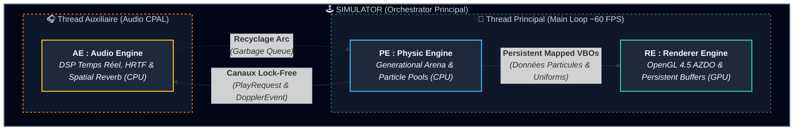
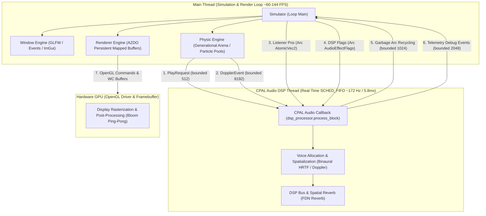
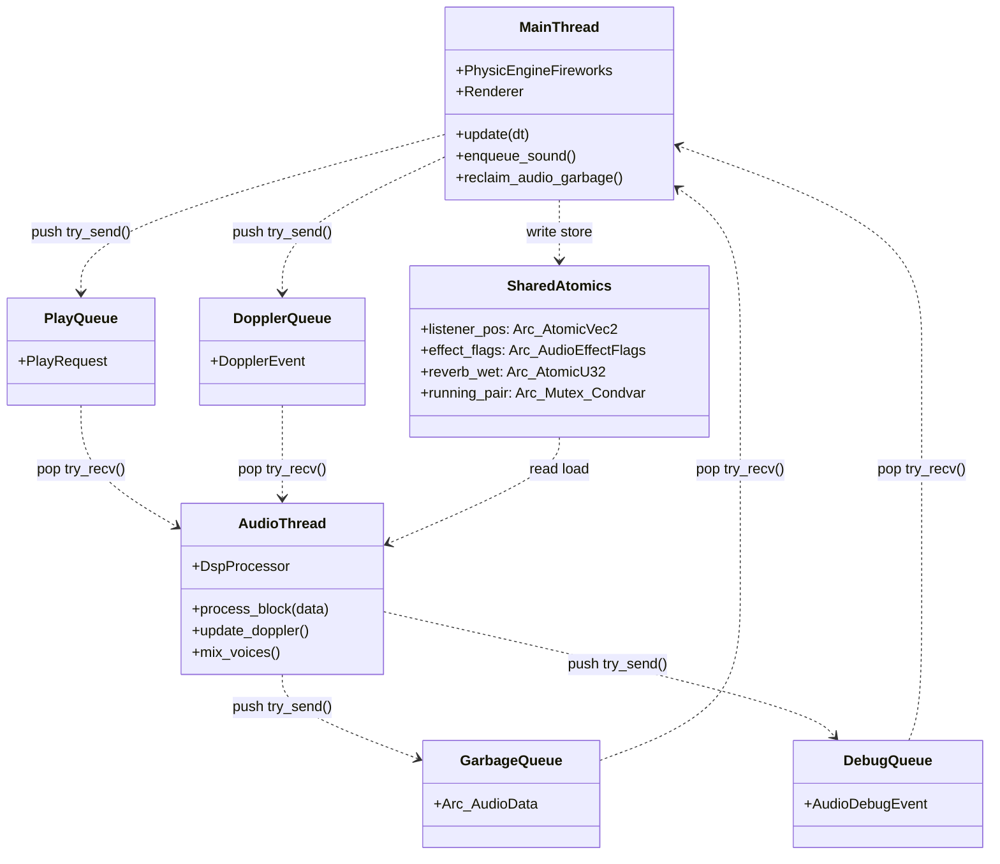
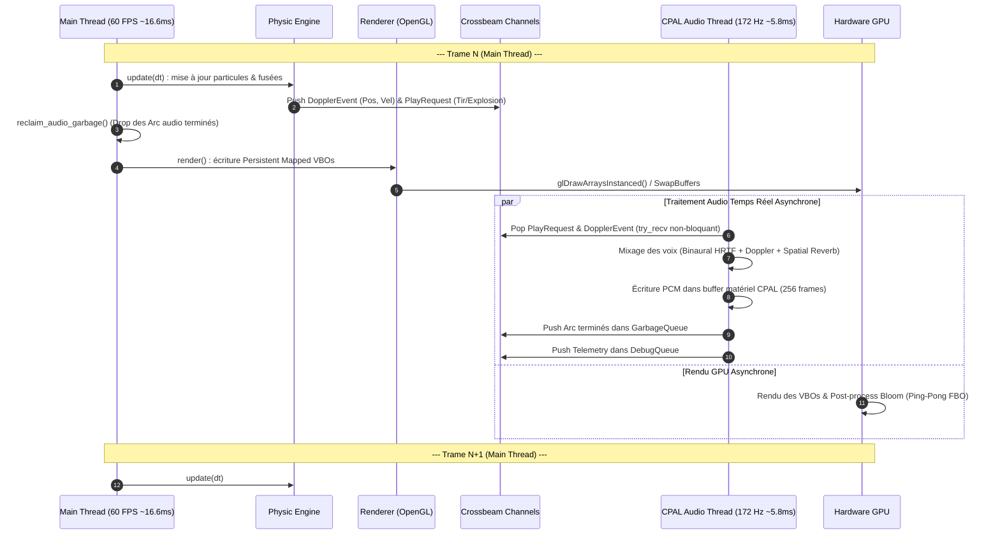

# Architecture des Moteurs, Threading et Synchronisation

> **Date** : 21 Juillet 2026
> **Application** : Fireworks Simulator (Rust / OpenGL AZDO / CPAL Audio 3D)
> **Cible** : Documentation Technique de l'Architecture Multi-Thread

---

## 📋 Table des Matières

1. [Vue d'Ensemble & Stratégie d'Architecture](#1-vue-densemble--stratégie-darchitecture)
2. [Diagrammes de Synthèse (Mermaid)](#2-diagrammes-de-synthèse-mermaid)
   - [Diagramme 0 : Vue Macro Épurée (Moteurs, Threads & Orchestrateur)](#diagramme-0--vue-macro-épurée-moteurs-threads--orchestrateur)
   - [Diagramme 1 : Vue d'Architecture Détaillée des Threads (Swimlanes)](#diagramme-1--vue-darchitecture-détaillée-des-threads-swimlanes)
   - [Diagramme 2 : Canaux de Communication & Primitives Lock-Free](#diagramme-2--canaux-de-communication--primitives-lock-free)
   - [Diagramme 3 : Séquence Temporelle & Découplage des Boucles](#diagramme-3--séquence-temporelle--découplage-des-boucles)
3. [Détail des Moteurs et de leur Thread d'Appartenance](#3-détail-des-moteurs-et-de-leur-thread-dappartenance)
   - [A. Thread Principal (Main / Simulation / Render Loop)](#a-thread-principal-main--simulation--render-loop)
   - [B. Thread Audio CPAL (Real-Time DSP Callback)](#b-thread-audio-cpal-real-time-dsp-callback)
   - [C. Pipeline de Rendu GPU (Contexte OpenGL & Matériel)](#c-pipeline-de-rendu-gpu-contexte-opengl--matériel)
4. [Mécanismes de Communication Inter-Threads (IPC)](#4-mécanismes-de-communication-inter-threads-ipc)
5. [Stratégies de Synchronisation et Gestion des Risques Temps Réel](#5-stratégies-de-synchronisation-et-gestion-des-risques-temps-réel)

---

## 1. Vue d'Ensemble & Stratégie d'Architecture

L'application **Fireworks Simulator** repose sur une architecture multi-threadée asynchrone hautement optimisée, découpée en trois moteurs principaux :
- **PE (Physic Engine)** : Simulation des particules, fusées, traînées et fumée (exécuté sur le CPU).
- **RE (Renderer Engine)** : Rendu graphique haute performance via OpenGL 4.5 AZDO (*Approaching Zero Driver Overhead*), Persistent Mapped Buffers et Triple Buffering (pilote le GPU).
- **AE (Audio Engine)** : Synthèse 3D binaurale temps réel, traitement Doppler, réverbération spatiale et bus DSP (exécuté sur un thread auxiliaire dédié temps réel).

Le défi majeur de cette architecture est le **découplage temporel** entre la boucle de rendu/physique (cadencée par l'affichage, typiquement 60 Hz à 144 Hz) et le traitement audio (cadencé par la carte son, typiquement 44.1 kHz / 48 kHz avec des blocs de 256 à 512 échantillons, soit ~172 Hz ou 5.8 ms par bloc).

---

## 2. Diagrammes de Synthèse (Mermaid)

### Diagramme 0 : Vue Macro Épurée (Moteurs, Threads & Orchestrateur)

Ce diagramme synthétique haut niveau valide et affine l'organisation fondamentale de l'application : l'orchestrateur (`Simulator`) englobe la physique (`PE`), le rendu (`RE`) et l'audio (`AE`), répartis entre le **Thread Principal** (boucle de simulation CPU et contextes GPU) et le **Thread Auxiliaire** (audio temps réel CPAL).

---

### Diagramme 1 : Vue d'Architecture Détaillée des Threads (Swimlanes)

Ce diagramme illustre l'isolation fine des trois moteurs dans leurs threads respectifs, ainsi que les points de contact inter-threads.

---

### Diagramme 2 : Canaux de Communication & Primitives Lock-Free

Ce diagramme montre précisément le fonctionnement des structures de données et des primitives de synchronisation entre le Main Thread et le Thread Audio.

---

### Diagramme 3 : Séquence Temporelle & Découplage des Boucles

Ce diagramme de séquence chronologique illustre comment la boucle de rendu et la boucle audio s'exécutent en parallèle de manière totalement asynchrone.

---

## 3. Détail des Moteurs et de leur Thread d'Appartenance

### A. Thread Principal (Main / Simulation / Render Loop)
* **Localisation du code** : [src/main.rs](../src/main.rs), [src/simulator.rs](../src/simulator.rs), et ses sous-modules dans [src/simulator/](../src/simulator/)
* **Architecture de l'Orchestrateur** : Afin d'éviter le couplage fort et la surcharge de `src/simulator.rs` (allégé à ~440 lignes), l'orchestrateur délègue désormais ses composants à des sous-modules autonomes dans le dossier `src/simulator/` (SoC) :
  - [src/simulator/audio_stress_scene.rs](../src/simulator/audio_stress_scene.rs) : Gère toute la logique interactive, la cinématique, les statistiques et le dessin GPU de la scène de stress.
  - [src/simulator/console_commands/](../src/simulator/console_commands/) : Enregistre à l'initialisation l'intégralité des commandes de la console interactive, divisée de manière modulaire (Audio, Physique, Renderer).
  - [src/simulator/ui.rs](../src/simulator/ui.rs) : Contient le rendu de l'interface utilisateur ImGui (dashboard de diagnostics, logs d'événements et console).
  - [src/simulator/events.rs](../src/simulator/events.rs) : Centralise la gestion des événements de la fenêtre GLFW (redimensionnement, plein écran, mode curseur) et le traitement des messages de débogage de l'AudioEngine.
* **Rôle** :
  - **Gestion de la Fenêtre & Entrées** : Traitement des événements GLFW (clavier, souris) et rendu de l'interface utilisateur ImGui.
  - **Exécution du Moteur Physique** ([src/physic_engine/physic_engine_generational_arena.rs](../src/physic_engine/physic_engine_generational_arena.rs)) : Mise à jour de la `GenerationalArena<Rocket>`, des pools de particules (`ParticlesPoolsForRockets`) et du système de fumée (`SmokeSystem`).
  - **Transmission des Événements Audio** : Génération des requêtes de son (`play_rocket`, `play_explosion`) et diffusion de la position/vitesse des fusées activement suivies dans la `DopplerQueue`.
  - **Collecte des Déchets Audio Mémoire** : Vidage de la `GarbageQueue` pour détruire les références `Arc<Vec<[f32; 2]>>` libérées par l'audio hors du thread critique audio.
  - **Pilotage du Renderer** ([src/renderer_engine/renderer.rs](../src/renderer_engine/renderer.rs)) : Transfert des données de particules vers les buffers VBO mappés de manière persistante (AZDO) et émission des commandes de dessin OpenGL.

### B. Thread Audio CPAL (Real-Time DSP Callback)
* **Localisation du code** : [src/audio_engine/fireworks_audio.rs](../src/audio_engine/fireworks_audio.rs), [src/audio_engine/dsp_processor.rs](../src/audio_engine/dsp_processor.rs) (avec tests isolés dans [src/audio_engine/dsp_processor/tests.rs](../src/audio_engine/dsp_processor/tests.rs))
* **Rôle** :
  - **Nom du Thread & Priorité** : Nommé `cpal_audio_dsp` / `CPAL Audio Callback`. Configuré sous Linux en priorité temps réel FIFO (`libc::SCHED_FIFO` priorité 20, ou fallback `nice -20`).
  - **Traitement de Bloc Audio (`process_block`)** : Exécuté à l'interruption matérielle de la carte son (ex: toutes les 5.8 ms pour 256 échantillons à 44.1 kHz).
  - **Zero-Allocation Hot Path** : Aucune allocation mémoire sur le tas (no `malloc`/`Vec::new`) dans le callback.
  - **Calculs DSP & Spacialisation 3D** :
    - Dépilage non-bloquant des requêtes et événements (`try_recv`).
    - Interpolation des positions/vitesses et calcul du pitch Doppler.
    - Traitement binaural HRTF.
    - Application de la réverbération spatiale FDN (*Feedback Delay Network*).
    - Envoi des pointeurs `Arc` expirés vers le Main Thread via la `GarbageQueue`.

### C. Pipeline de Rendu GPU (Contexte OpenGL & Matériel)
* **Localisation du code** : [src/renderer_engine/renderer_graphics_instanced.rs](../src/renderer_engine/renderer_graphics_instanced.rs)
* **Rôle** :
  - **Contexte OpenGL 4.5** : Détenu et piloté par le Main Thread.
  - **AZDO & Persistent Mapping** : Buffers VBO/UBO mappés en mémoire hôte avec pointeurs persistants.
  - **Triple Buffering & Fences** : Découplage de l'écriture CPU et de la lecture GPU pour éviter tout *stall* de la boucle de rendu.

---

## 4. Mécanismes de Communication Inter-Threads (IPC)

| Canaux / Variable Shared | Type de Structure | Directivité | Description & Rôle |
| :--- | :--- | :--- | :--- |
| `play_tx` / `play_rx` | `crossbeam_channel::bounded(512)` | Main -> Audio | Canal Lock-free SPSC/MPMC des requêtes de son (`PlayRequest`). Transmet un `Arc` du buffer audio wave sans copie de données. |
| `doppler_sender` / `receiver` | `crossbeam_channel::bounded(8192)` | Physic -> Audio | Queue Lock-free des événements de déplacement (`DopplerEvent`). Transmet la position, vitesse et gain de chaque fusée à chaque frame. |
| `garbage_tx` / `garbage_rx` | `crossbeam_channel::bounded(1024)` | Audio -> Main | Canal de recyclage mémoire. L'audio y pousse les `Arc` terminés pour que le Main Thread effectue la désallocation. |
| `debug_tx` / `debug_rx` | `crossbeam_channel::bounded(2048)` | Audio -> Main | Telemétrie et diagnostique audio (latence, sons joués, sons dropped par file pleine). |
| `listener_pos` | `Arc<AtomicVec2>` | Main -> Audio | Position 2D de l'écouteur partagée de manière atomique (Lock-free bitwise float). |
| `effect_flags` | `Arc<AudioEffectFlags>` | Main -> Audio | Masque binaire d'octets atomique (`AtomicU32`) permettant l'activation/désactivation dynamique des filtres DSP depuis l'UI sans lock. |
| `reverb_wet` | `Arc<AtomicU32>` | Main -> Audio | Réglage atomique du niveau Wet de la réverbération spatiale. |
| `running_pair` | `Arc<(Mutex<bool>, Condvar)>` | Main <-> Audio | Synchronisation de démarrage et signal d'arrêt propre du thread audio lors du shutdown de l'application. |

---

## 5. Stratégies de Synchronisation et Gestion des Risques Temps Réel

1. **Garantie Temps Réel Audio (Zero Lock Contention)** :
   - Le callback audio CPAL n'utilise **aucun Mutex ni Lock** sur le chemin critique de traitement audio. Toutes les lectures de paramètres de configuration se font via des primitives atomiques (`AtomicU32`, `AtomicVec2`, `AudioEffectFlags`).
2. **Débordement de File (Graceful Degradation)** :
   - En cas d'émission massive de sons sur une seule trame, le canal `play_tx` (borné à 512) utilise `try_send()`. Si la file est pleine, l'événement est rejeté et comptabilisé dans les statistiques `audio_dropped`, évitant tout blocage du moteur physique ou du moteur audio.
3. **Nettoyage de Mémoire Déporté (Garbage Collector Pattern)** :
   - Lorsqu'une voix audio termine sa lecture, la désallocation du pointeur `Arc<Vec<[f32; 2]>>` pourrait déclencher un appel `free()` potentiellement bloquant sur le thread audio. Le moteur audio transfère la propriété de l'Arc à la `GarbageQueue`, permettant au Main Thread d'exécuter la libération mémoire lors de son propre passage dans la boucle de trame.
4. **Synchronisation CPU-GPU (AZDO Triple Buffering)** :
   - Le moteur de rendu graphique découpe ses VBOs persistent en 3 anneaux (Triple Buffering). Pendant que le GPU lit l'anneau `N`, le CPU prépare et écrit l'anneau `(N+1) % 3` via des accès Write-Combining non bloquants.

---

*Documentation générée pour la spécification technique des moteurs `rust-firework`.*
