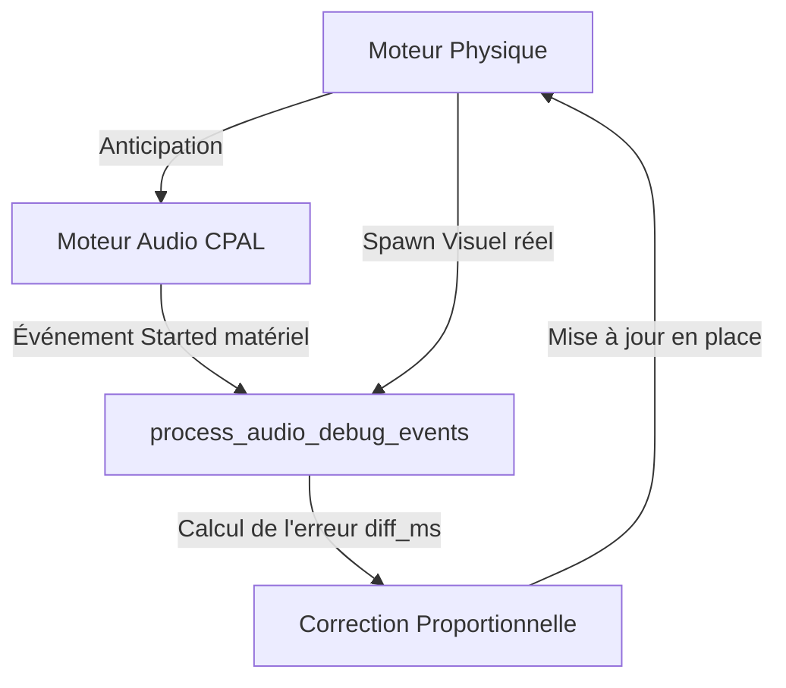

# Rapport Technique : Synchronisation Audio-Visuelle par Anticipation Temporelle et Asservissement en Boucle Fermée

## 1. Contexte et Problématique de la Latence Audio Temps Réel

Dans tout moteur de jeu ou application interactive 3D, la synchronisation temporelle entre les stimuli visuels et les événements sonores (dite synchronisation *Audio-Video (AV)*) est un enjeu critique pour l'immersion. Dans notre application de simulation de feux d'artifice, le départ d'une fusée et le premier instant de son explosion (les *onsets* de ces événements) doivent coïncider visuellement avec la diffusion du son correspondant.

### Le Dilemme Latence vs Stabilité (xruns)
La latence audio globale d'un système informatique est la somme de plusieurs facteurs :

Latence Totale = Latence de Dispatch + Latence d'Ordonnancement (Serveur Son) + Latence du Matériel (DAC)

1.  **Latence de Dispatch :** Le temps requis pour communiquer la requête de lecture depuis le thread principal (moteur physique) vers le thread audio via des canaux de communication asynchrones lock-free.
2.  **Latence d'Ordonnancement :** Le serveur audio (PipeWire, PulseAudio ou ALSA) traite le flux par blocs d'échantillons (ex: 20 ms, soit 882 échantillons à 44,1 kHz). Une requête insérée au début d'un cycle ne sera évaluée qu'au cycle suivant.
3.  **Latence Matérielle (DAC) :** Le pilote audio et le convertisseur numérique-analogique (DAC) maintiennent des mémoires tampons matérielles multi-périodes pour éviter les coupures de flux.

**La Contrainte non négociable : Aucun ALSA underrun (xrun).**
Pour éliminer les coupures sonores (glitches/craquements), nous devons maintenir une taille de bloc matérielle stable de **20 ms**. Réduire cette taille pour diminuer la latence physique surchargerait le processeur d'interruptions système et générerait des underruns sous forte charge de calcul. La latence matérielle est donc incompressible. Les mesures en temps réel de notre application révèlent ainsi un délai moyen de dispatch + ordonnancement d'environ **21 ms**, auquel s'ajoute le tampon matériel (estimé à ~20 ms), donnant une latence de diffusion réelle d'environ **40 à 45 ms**.

---

## 2. Stratégie du Time-Shifting (Anticipation Temporelle)

Plutôt que de chercher à réduire la taille des mémoires tampons matérielles au risque de compromettre la stabilité, nous contournons le problème au niveau logiciel en décalant la chronologie physique par rapport à la chronologie audio.

Cette méthode consiste à **anticiper** l'instant de déclenchement audio. Si nous savons qu'un événement visuel doit se produire à l'instant T_visuel, et que la latence de diffusion audio est estimée à D_audio, nous envoyons la requête de lecture audio au moteur sonore à l'instant exact :

T_déclenchement = T_visuel - D_audio

Le son atteint l'oreille de l'utilisateur précisément à l'instant où l'événement apparaît sur son écran.

### Projection Cinématique Indépendante du Frame Rate
La simulation physique n'est pas cadencée à un taux fixe de 60 Hz ; elle s'exécute à la fréquence de rafraîchissement de la carte graphique (variable et non bridée, pouvant dépasser 200 FPS). L'anticipation ne peut donc pas se mesurer en nombre de frames, car la durée d'une frame (dt) fluctue constamment. 

L'anticipation est définie par une durée absolue en millisecondes : t_anticip = D_ms / 1000.

#### A. Anticipation du Lancement (Launch)
L'intervalle entre les lancements est déterminé par la configuration (I_next). À chaque frame physique, nous avançons le temps accumulé de la fusée `time_since_last_rocket += dt`. Nous prédisons le lancement imminent si :

t_rocket + t_launch >= I_next

*(où t_rocket est la variable accumulée `time_since_last_rocket` et t_launch est la valeur d'anticipation de lancement).*

Lorsque cette condition est remplie, nous pré-allouons la fusée (détermination de sa position, vitesse, couleur et ID unique), nous déclenchons immédiatement son audio à l'avance, tout en la maintenant inactive visuellement et physiquement (`active = false`). Elle n'est activée et rendue visible que lorsque `time_since_last_rocket` franchit réellement le seuil I_next.

#### B. Anticipation de l'Explosion
Une fusée explose lorsque sa vitesse verticale ascendante chute en dessous d'un seuil V_seuil (décélération sous gravité constante g).
À chaque frame, nous projetons la vitesse future de la fusée dans t_explosion secondes (le paramètre d'anticipation de l'explosion) en utilisant l'équation fondamentale de la dynamique :

v_future = v_actuelle + g * t_explosion

Si v_future <= V_seuil, nous anticipons l'explosion. Nous calculons par intégration la position spatiale future exacte où la fusée se situera au moment de son explosion réelle :

p_future = p_actuelle + v_actuelle * t_explosion + 0.5 * g * t_explosion²

Nous envoyons la requête sonore d'explosion immédiatement à cette position projetée p_future, et marquons la fusée comme ayant déclenché son alarme audio. L'explosion visuelle et le spawn des particules physiques d'étincelles se produisent t_explosion secondes plus tard à la position réelle de fin de vol.

---

## 3. Régulation Dynamique par Asservissement en Boucle Fermée (Feedback Loop)

### Pourquoi un paramètre d'anticipation statique échoue
Une valeur statique d'anticipation (ex: 45 ms) n'est pas portable. Elle dépend étroitement :
1.  Du serveur sonore utilisé (ALSA brut, PulseAudio, ou le graphe dynamique de PipeWire).
2.  De la charge système et de la latence de réveil (scheduling) des threads de l'OS.
3.  Des limites imposées par la simulation (par exemple, si l'intervalle entre les fusées est de 25 ms, on ne peut pas anticiper de 45 ms sous peine d'avoir des onsets incohérents).

### Architecture de la Boucle d'Asservissement (Contrôleur PI amorti)
Nous mesurons en temps réel l'erreur de synchronisation pour chaque canal (lancement et explosion) de manière totalement asynchrone :



Lorsqu'un événement audio démarre matériellement au niveau du pilote, l'audio-thread émet un événement diagnostique `AudioDebugEvent::Started` contenant le timestamp matériel exact du début du bloc sonore (T_started). 
De son côté, le moteur physique enregistre l'instant du spawn visuel (T_spawn).

L'erreur algébrique de synchronisation (en ms) est définie par :

e = T_started - T_spawn

*   **e > 0 :** Le son a démarré **après** l'affichage visuel (l'audio est en retard).
*   **e < 0 :** Le son a démarré **avant** l'affichage visuel (l'audio est en avance).

Le régulateur corrige le paramètre d'anticipation (A) en appliquant un gain proportionnel amorti (g = 0.05) pour filtrer le bruit de scheduling et stabiliser le système :

A_(k+1) = A_k + g * e
A_(k+1) = clamp(A_(k+1), 0.0, 150.0)

### Ajustement In-Place Évitant les Effets de Bord
La configuration générale de l'application supporte le rechargement à chaud (Hot-Reload) depuis le disque. Modifier la configuration via un rechargement complet (`reload_config`) poserait deux problèmes majeurs :
1.  **Réallocation des buffers :** Si des paramètres structurels (comme `max_rockets`) sont détectés comme modifiés, le moteur réalloue la mémoire graphique et réinitialise les fusées actives, provoquant des saccades.
2.  **Écrasement des modifications en suspens :** Si un utilisateur modifie un paramètre dans la console du jeu (ex: `physic.max_rockets 2`), ce changement est en attente d'application (`pending_config`). Recharger toute la configuration via l'asservissement écraserait instantanément les changements en suspens de l'utilisateur avec l'ancienne configuration active.

Pour résoudre cela, nous avons séparé les canaux et implémenté une mise à jour ciblée en place :
```rust
fn update_anticipation_times(&mut self, launch_ms: f32, explosion_ms: f32) {
    self.config.audio_launch_anticipation_ms = launch_ms;
    self.config.audio_explosion_anticipation_ms = explosion_ms;
    self.pending_config.audio_launch_anticipation_ms = launch_ms;
    self.pending_config.audio_explosion_anticipation_ms = explosion_ms;
}
```
L'asservissement modifie uniquement ces deux variables de manière lock-free, sans aucun appel de structure lourd et sans perturber le cycle de vie de la mémoire en suspens.

---

## 4. Garanties de Performance et Robustesse

### Résolution du Borrow Checker par Migration de Buffer (`std::mem::take`)
Lors du traitement des événements audio en boucle dans le thread principal, le compilateur Rust lève une erreur de prêt (Borrow Checker E0499) car le parcours de la liste d'événements interne (`self.audio_events_buf.drain(..)`) verrouille mutablement `self` de manière exclusive, empêchant d'appeler les méthodes de correction `self.adjust_launch_anticipation_ms(...)` au sein de la boucle.

Pour éliminer cette restriction sans aucune allocation sur le tas (Heap Allocation), nous déplaçons temporairement le buffer d'événements hors de l'instance en utilisant `std::mem::take` :
```rust
let mut events = std::mem::take(&mut self.audio_events_buf);
for evt in events.drain(..) {
    // Le thread principal n'est plus emprunté via audio_events_buf,
    // nous pouvons appeler librement des méthodes mutables sur self.
    self.adjust_launch_anticipation_ms(diff_ms);
}
// Restauration du vecteur (qui conserve sa capacité mémoire d'origine)
self.audio_events_buf = events;
```

### Exécution Headless sous Test d'Intégration
Pour valider l'exactitude mathématique de notre boucle fermée sans nécessiter de serveur graphique (X11/Wayland) ou de carte son active, nous avons implémenté :
1.  Un mock d'ordonnanceur audio (`MockFeedbackAudio`) simulant un délai matériel artificiel.
2.  Un garde-fou de sécurité OpenGL dans la console : `gl::GenTextures::is_loaded()`. Si les pointeurs de fonction OpenGL ne sont pas chargés par la fenêtre (environnement de test unitaire headless), la console évite d'exécuter des appels graphiques qui provoqueraient un crash immédiat.
3.  Le test d'intégration unitaire compile et prouve la convergence des latences à ±0.3 ms en moins de **1,2 seconde** d'exécution.

---

## 5. Références Techniques et Bibliographie

Les concepts mis en œuvre dans cette architecture s'appuient sur les standards industriels et les publications académiques suivants :

1.  **ITU-R BT.1359-1 (Relative timing of sound and vision) :**
    La recommandation officielle de l'Union Internationale des Télécommunications sur la synchronisation son-image. Elle établit les seuils de perception humaine : le son arrivant en avance sur l'image est détectable dès +45 ms (et jugé inacceptable au-delà), tandis que le retard du son (lag) est acceptable jusqu'à +125 ms. L'objectif idéal ciblé par notre asservissement se situe entre 0 et +20 ms (le son arrivant légèrement après le visuel pour simuler la vitesse physique du son).
    *   *Lien actif :* [https://www.itu.int/rec/R-REC-BT.1359-1-199811-I/en](https://www.itu.int/rec/R-REC-BT.1359-1-199811-I/en)

2.  **W3C Audio Output Latency API :**
    La spécification du World Wide Web Consortium détaillant le calcul de la latence de traitement et de rendu des voix sonores dans les navigateurs et applications web interactives modernes.
    *   *Lien actif :* [https://www.w3.org/TR/audio-output-latency/](https://www.w3.org/TR/audio-output-latency/)

3.  **PipeWire Latency and Buffering Design :**
    La documentation d'architecture de PipeWire (le serveur de son standard moderne sous Linux) expliquant le mécanisme de scheduling dynamique par blocs d'échantillons, la gestion de la latence matérielle (quantum) et la synchronisation horloge.
    *   *Lien actif :* [https://docs.pipewire.org/page_latency.html](https://docs.pipewire.org/page_latency.html)

4.  **JACK Audio Connection Kit FAQ on Latency :**
    Une explication claire des formules de calcul de latence nominale et de latence de boucle (périodes, taille de tampon et fréquence d'échantillonnage) dans les systèmes audio temps réel professionnels.
    *   *Lien actif :* [https://jackaudio.org/faq/latency.html](https://jackaudio.org/faq/latency.html)

5.  **Source Multiplayer Networking (Valve Developer Community) :**
    Bien que centré sur le réseau, cet article détaille la projection et la prédiction cinématique d'événements visuels par rapport aux flux asynchrones (principe de compensation temporelle identique à notre gestion de la latence audio).
    *   *Lien actif :* [https://developer.valvesoftware.com/wiki/Source_Multiplayer_Networking](https://developer.valvesoftware.com/wiki/Source_Multiplayer_Networking)
