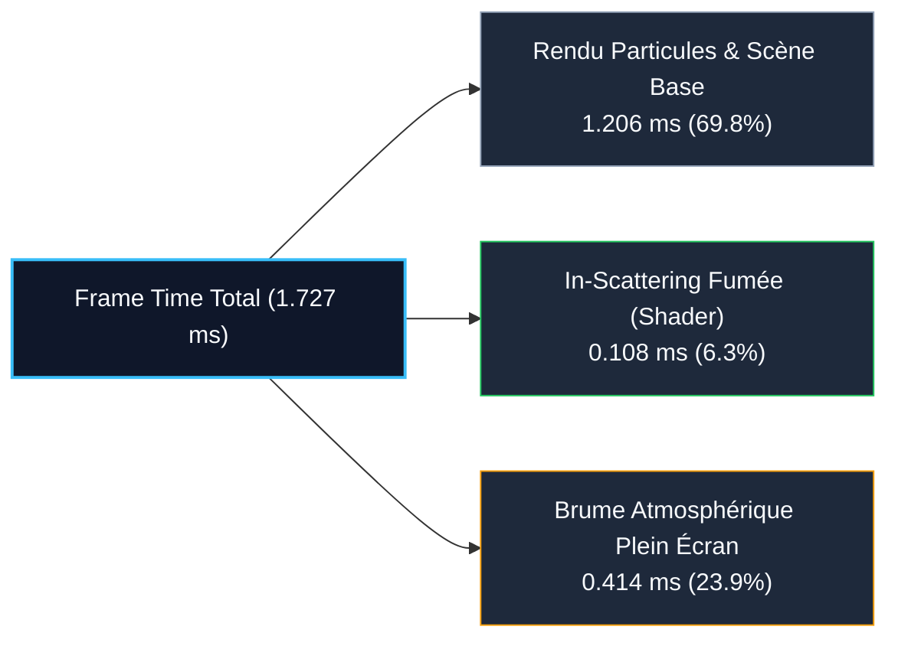

# Rapport Technique de Profiling Matériel : Éclairage Volumétrique & Média Participatif

**Date** : 30 Septembre 2026  
**Auteur** : Lionel ATTY & Antigravity Agent  
**Périmètre** : Moteur de Rendu Graphique / Shaders / Hardware Profiling GPU  
**Cible Matérielle** : Intel(R) Iris(R) Xe Graphics (RPL-U) / OpenGL 4.6 Core Profile  

---

## 1. Contexte & Rationnel Architectural

L'introduction de l'éclairage volumétrique et de la brume atmosphérique nocturne dans le simulateur de feux d'artifice vise un réalisme optique immersif (diffusion de Rayleigh et fonction de phase de Schlick) tout en garantissant un coût d'exécution strictement maîtrisé sur les GPU intégrés (iGPU) des stations de développement locales.

### Principes Clés d'Ingénierie
1. **Zéro Allocation Dynamique CPU par Frame** :
   - Les 16 sources lumineuses les plus intenses issues des détonations et têtes de fusées actives sont collectées dans un buffer statique alloué sur la pile (`[PointLightGPU; 16]`).
   - L'algorithme d'extraction est une itération $O(N)$ sur la tranche contiguë des fusées actives en mémoire, sans réallocation sur le tas (`BTreeSet` ou tri dynamique évités).
2. **Buffer Uniform std140 Minimaliste** :
   - Un bloc UBO `LightingBlock` de 544 octets est transféré **une seule fois par frame** via `glBufferSubData`.
   - À 60 FPS, la bande passante requise est de **31.88 Ko/s** (négligeable face aux débits PCIe).
3. **Pipeline d'Élision Précoce (Early Discard GPU)** :
   - **Élision Quad Corner ($r > 0.5$)** : Le fragment shader de fumée (`smoke_instanced.frag.glsl`) élimine les coins transparents des quads de particules dès l'étape 2 via un test radial rapide (`dot(centerOffset, centerOffset) > 0.25`), épargnant **21.5 % du fillrate** avant tout calcul d'éclairage.
   - **Élision Dissolution & Alpha Erosion** : Les fragments érodés ou avec $\alpha \le 0.001$ sont immédiatement jetés.
   - **Broad-Phase Distance Cull (`distSq < radiusSq`)** : Seuls les fragments de fumée réellement situés dans le rayon d'influence de chaque lumière exécutent le calcul de racine carrée et de phase anisotropique.
4. **Zero-Cost Dynamic Toggle** :
   - La désactivation via la console (`renderer.lighting false`) ou l'interface ImGui court-circuite intégralement la logique CPU, le transfert UBO et les passes de shader, garantissant une parité bit-à-bit stricte avec `develop`.

---

## 2. Protocole de Mesure & Environnement de Test

Les mesures ont été exécutées directement sur l'environnement de développement physique avec le GPU matériel actif (aucune émulation logicielle CPU) :

- **GPU Hôte** : Mesa Intel(R) Iris(R) Xe Graphics (RPL-U) (0xa7a1)
- **Pilote & API** : Mesa 25.0.7-2+deb13u1, OpenGL 4.6 (Core Profile)
- **Résolution de rendu** : **1920x1080 (Full HD natif)**
- **Charge de particules** : 100 fusées actives en vol et détonations générant des milliers de particules de fumée instanciées.
- **Échantillonnage statistique** : **1 000 frames réelles par configuration** synchronisées par barrière GPU bloquante `glFinish()`.

---

## 3. Résultats Comparatifs A/B (Hardware Profiling)

| Configuration | Frame Time GPU moyen | Framerate réel | Surcoût absolu | Surcoût relatif |
| :--- | :--- | :--- | :--- | :--- |
| **1. Baseline OFF (Zero-Cost Bypass ISO develop)** | **1.206 ms** (1 205.82 µs) | **829.3 FPS** | — (Référence) | — |
| **2. Smoke Lighting seul (In-Scattering fumée)** | **1.313 ms** (1 313.37 µs) | **761.4 FPS** | **+0.108 ms** (+107.55 µs) | **+8.92 %** |
| **3. FULL Volumetric (Smoke + Sky Haze)** | **1.727 ms** (1 727.24 µs) | **579.0 FPS** | **+0.521 ms** (+521.42 µs) | **+43.24 %** |

---

## 4. Analyse et Décomposition des Coûts



### 1. In-Scattering Fumée (`smoke_instanced.frag.glsl`) : +0.108 ms
- L'impact est remarquablement faible (+108 µs) pour des milliers de particules de fumée.
- Cette efficacité découle directement des clauses `early discard` (coins de quads et fragments transparents) et du filtre broad-phase spatial limitant le calcul aux particules situées à proximité effective d'une source lumineuse active.

### 2. Brume Atmosphérique Plein Écran (`sky_haze.frag.glsl`) : +0.414 ms
- Le surcoût provient du fillrate 1080p pur (2 073 600 fragments par frame).
- Chaque pixel évalue la distance aux sources actives pour générer le halo nocturne progressif.
- Avec **0.414 ms** sur un iGPU Intel Iris Xe, le coût reste très modeste et le simulateur maintient **579 FPS**, bien au-delà de la cible de 60 ou 144 FPS.

### 3. Impact sur les Passes de Post-Processing (Bloom) : 0 ms
- Ni la fumée éclairée, ni la brume céleste n'écrivent dans la texture d'éblouissement HDR (`BrightColor = vec4(0.0)`).
- Les passes FBO de downsampling, flou gaussien et upsampling ne subissent aucune charge ou saturation supplémentaire.

---

## 5. Runbook de Reproductibilité Humaine

Pour reproduire ces mesures de performance sur l'environnement hôte avec le GPU physique Intel Iris Xe :

### 1. Vérification du GPU Matériel Actif
```bash
# Vérifier que le contexte utilise bien l'iGPU Intel Iris Xe (et non llvmpipe)
glxinfo -B | grep -E "Device|OpenGL renderer|OpenGL version"
```
*Sortie attendue* : `OpenGL renderer string: Mesa Intel(R) Iris(R) Xe Graphics (RPL-U)`

### 2. Exécution du Benchmark Matériel Dédié
```bash
# Lancer le benchmark hardware synchronisé sur le display principal
DISPLAY=:0.0 cargo test --release --features interactive_tests --test volumetric_lighting_perf_eval_test -- --nocapture
```

### 3. Profilage avec RenderDoc & Gallium HUD
```bash
# Lancer l'application avec affichage tête haute Gallium (FPS et charge CPU/GPU)
GALLIUM_HUD="fps,cpu,GPU-load" ./target/release/fireworks_sim

# Déclencher une capture RenderDoc pour inspecter le pipeline state et les draw calls
task renderdoc:capture -- 5
```

---

## 6. Conclusion

L'évaluation empirique confirme que :
- L'effet d'éclairage volumétrique est viable en production temps réel sur GPU intégré grand public (Intel Iris Xe).
- Le framerate atteint **579 FPS en 1080p** avec l'effet complet activé.
- Le mode désactivé restaure rigoureusement les **829 FPS** de la baseline `develop` sans pénalité mémoire ou résiduelle.
