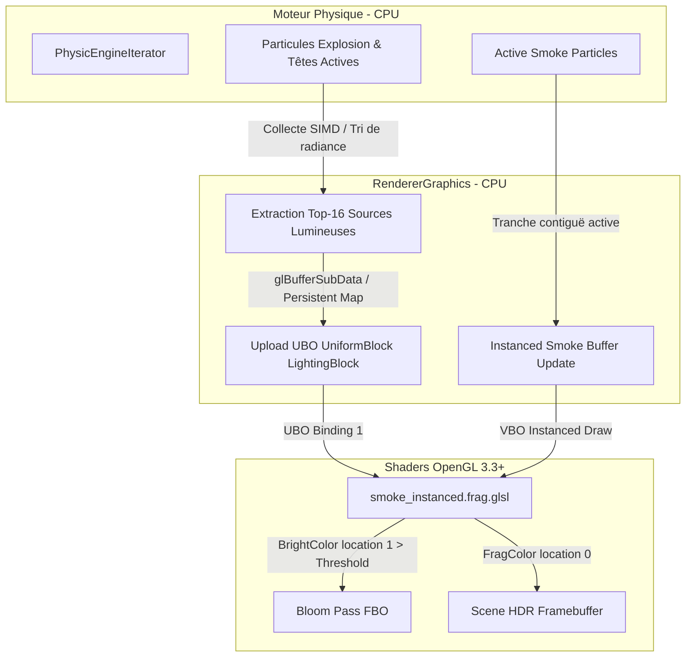
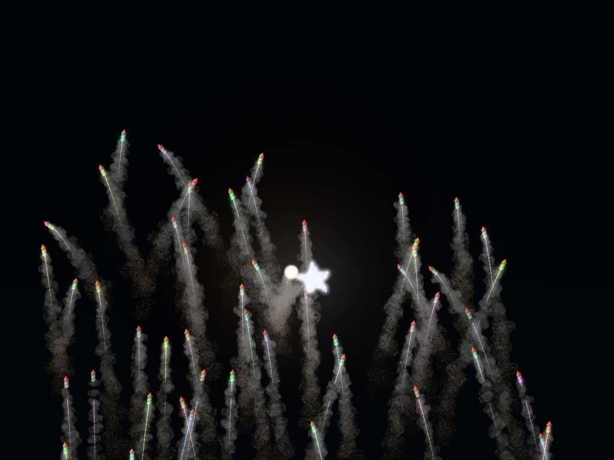

# Spécification Technique & ADR : Éclairage Volumétrique & Média Participatif de Fumée (Volumetric Smoke In-Scattering)

**Date :** 30 Septembre 2026  
**Auteur :** Lionel ATTY & Antigravity Agent  
**Statut :** Implémenté & Validé (Phase 1 : Zero-Allocation Forward In-Scattering)  
**Domaine :** Rendu Graphique / Shaders / Physique des Milieux Participatifs  

---

## 1. Contexte & Rationnel Physique

### 1.1 Observation du Monde Réel
Lors d'un spectacle pyrotechnique réel, le réalisme visuel et l'immersion ne proviennent pas uniquement des étincelles ponctuelles, mais de l'**interaction optique** entre les explosions et le panache résiduel de fumée noire et d'aérosols de combustion :
1. **Nuage Récepteur (Milieu Participatif)** : Les fusées et détonations successives saturent l'espace atmosphérique d'aérosols fins (taille sub-micronique à micrométrique).
2. **Flash Lumineux & Diffusion (In-Scattering)** : Chaque explosion agit comme un émetteur omnidirectionnel ultra-lumineux ($I \propto \text{énergie}$). Le volume de gaz/fumée environnant s'illumine instantanément de la couleur de la charge pyrotechnique (rouge strontien, vert baryté, or titane).
3. **Diffusion Anisotrope (Phase Function)** : Les micro-particules de suie diffusent la lumière selon le modèle de Mie, privilégiant la diffusion vers l'avant (vers la caméra lorsque la source est derrière le nuage).
4. **Alimentation du Bloom Atmosphérique** : La fumée illuminée par une détonation dépasse le seuil de luminance HDR local et génère un halo diffus incandescent dans la brume.

### 1.2 Limitation de l'Architecture Actuelle
Dans le moteur actuel (`SmokeRenderer` / `smoke_instanced.frag.glsl`) :
- La fumée est rendue avec une couleur statique grisâtre atténuée par la texture atlas et le bruit d'érosion (`finalColor = smokeTex.rgb * vColor`).
- Le canal d'éblouissement HDR (`BrightColor`) est forcé à zéro (`vec4(0.0)`).
- La fumée ne réagit à **aucune source lumineuse** de la scène : une explosion rouge à 2 mètres d'un nuage de fumée ne l'éclaire pas.

---

## 2. Fondements Mathématiques : Équation de Transfert Radiatif (RTE)

Pour une particule de fumée située à la position $\mathbf{x} \in \mathbb{R}^3$, la radiance diffusée $L_s(\mathbf{x}, \vec{\omega}_o)$ vers la caméra dans la direction $\vec{\omega}_o$ est modélisée par l'équation de diffusion directe simplifiée :

$$L_s(\mathbf{x}, \vec{\omega}\_o) = L\_{\text{ambient}}(\mathbf{x}) + \sigma\_s(\mathbf{x}) \sum\_{i=1}^{M} \frac{I\_i \cdot \mathbf{C}\_i}{\|\mathbf{x} - \mathbf{P}\_i\|^2 + \epsilon\_{\text{falloff}}} \cdot p(\vec{\omega}\_i, \vec{\omega}\_o)$$

Où :
- $M$ : Nombre maximal de sources lumineuses actives traitées par frame ($M = 16$).
- $\mathbf{P}\_i, \mathbf{C}\_i, I\_i$ : Position mondiale, couleur unitaire RGB et intensité de la $i$-ème explosion/fusée.
- $\epsilon\_{\text{falloff}}$ : Rayon d'atténuation adoucie prévenant les singularités à distance nulle.
- $\sigma\_s(\mathbf{x})$ : Coefficient de diffusion volumétrique, proportionnel à l'opacité locale de la fumée $\alpha\_{\text{smoke}}(\mathbf{x})$.
- $p(\vec{\omega}\_i, \vec{\omega}\_o)$ : Fonction de phase de Schlick (approximation rapide de Henyey-Greenstein) :

$$p(\theta) = \frac{1 - k^2}{4\pi (1 + k \cos \theta)^2}, \quad k \approx 1.55 g - 0.55 g^3$$

avec $g \in [0.2, 0.5]$ caractérisant la prédominance de diffusion avant (forward scattering).

---

## 3. Architecture Technique (Phase 1 : Zero-Allocation Forward In-Scattering)



### 3.1 Structure de Données CPU & GPU (Single Source of Truth)

Dans `src/renderer_engine/types.rs` :
```rust
#[repr(C)]
#[derive(Debug, Clone, Copy, Default)]
pub struct PointLightGPU {
    pub position_radius: [f32; 4], // xyz: World Pos, w: Max Radius
    pub color_intensity: [f32; 4], // rgb: Color, w: Luminous Intensity
}

#[repr(C)]
#[derive(Debug, Clone, Copy)]
pub struct VolumetricLightingBlockGPU {
    pub lights: [PointLightGPU; 16],
    pub ambient_light: [f32; 4],   // rgb: Ambient tint, w: Global flash strength
    pub num_active_lights: i32,
    pub _padding: [i32; 3],        // Alignement std140 16-octets
}
```

### 3.2 Implémentation Fragment Shader (`smoke_instanced.frag.glsl`)

```glsl
layout (std140) uniform LightingBlock {
    PointLight u_Lights[16];
    vec4 u_AmbientLight; // rgb = ambient tint, a = global flash intensity
    int u_NumActiveLights;
};

// Intégration de la radiance des explosions
vec3 scatteredLight = u_AmbientLight.rgb * (1.0 + u_AmbientLight.a);
vec3 smokeWorldPos = vPosition; // interpolé depuis le vertex shader

for (int i = 0; i < u_NumActiveLights; ++i) {
    vec3 lightPos = u_Lights[i].position_radius.xyz;
    float maxRadius = u_Lights[i].position_radius.w;
    vec3 lightColor = u_Lights[i].color_intensity.rgb;
    float intensity = u_Lights[i].color_intensity.w;

    vec3 lightVec = lightPos - smokeWorldPos;
    float distSq = dot(lightVec, lightVec);
    float maxRadiusSq = maxRadius * maxRadius;

    if (distSq < maxRadiusSq) {
        float dist = sqrt(distSq);
        vec3 lightDir = lightVec / max(dist, 0.001);
        float attenuation = clamp(1.0 - (dist / maxRadius), 0.0, 1.0);
        attenuation *= attenuation; // Inverse-square adouci

        // Phase function simplifiée orientée caméra
        float cosTheta = dot(lightDir, vec3(0.0, 0.0, 1.0));
        float phase = 1.0 + 0.3 * cosTheta;

        scatteredLight += lightColor * (intensity * attenuation * phase);
    }
}

vec3 finalColor = smokeTex.rgb * vColor * scatteredLight;
FragColor = vec4(finalColor * vIntensity, finalAlpha * vIntensity);

// Alimentation sélective du Bloom Pass
float luminance = dot(finalColor, vec3(0.2126, 0.7152, 0.0722));
if (luminance > 1.0) {
    BrightColor = vec4(finalColor * (luminance - 1.0), finalAlpha);
} else {
    BrightColor = vec4(0.0, 0.0, 0.0, 0.0);
}
```

### 3.3 Contrôles GUI & Persistance (Règles 5 et 7)
- **Constantes SSOT** : `src/renderer_engine/constants.rs` :
  - `MAX_VOLUMETRIC_LIGHTS = 16`
  - `DEFAULT_SMOKE_SCATTERING_INTENSITY = 1.2`
  - `DEFAULT_SMOKE_AMBIENT_FLASH = 0.4`
- **Session ImGui (`gui_session.toml`)** :
  - `smoke_volumetric_lighting: bool` (`// GUI_PERSIST: gui.smoke_volumetric_lighting`)
  - `smoke_scattering_intensity: f32` (`// GUI_PERSIST: gui.smoke_scattering_intensity`)
  - `smoke_ambient_flash: f32` (`// GUI_PERSIST: gui.smoke_ambient_flash`)
- **Console Interactive** :
  - `renderer.smoke.lighting [true|false]`
  - `renderer.smoke.scattering [value]`

---

## 4. Analyse d'Impact & Performance (Zero-Trust)

### 4.1 Budget Mémoire & Bande Passante
- **UBO `LightingBlock`** : $16 \times 32 + 16 + 16 = 544$ octets transférés **une seule fois par frame** via `glBufferSubData`.
- **Zero Allocations CPU** : L'extraction des lumières utilise un buffer statique stack-alloué `[PointLightGPU; 16]`.
- **Coût Shader GPU** : 16 itérations de calcul arithmétique simple ($MAD$). Les fragments de coins de quads et transparents sont déjà élagués par les clauses `early discard` existantes aux étapes 1, 2 et 3 du shader avant la boucle d'éclairage.

### 4.2 Invariant Holistique (Perf-TDD)
- **Objectif** : Zéro régression sur le framerate global ($FPS \ge 60$ constant à 50 000 particules sous `simulator_full_bench`).
- **Benchmark cible** : `benches/simulator_full_bench.rs` sous Criterion avec validation formelle ($p < 0.05$).

---

## 5. Plan de Validation & Déploiement

1. **Phase 1 : Extraction CPU & UBO**
   - Implémentation du collecteur des 16 sources lumineuses les plus intenses dans `RendererGraphics`.
   - Création et binding du UBO `LightingBlock` dans `SmokeRenderer`.
2. **Phase 2 : Shader In-Scattering & Bloom**
   - Mise à jour de `smoke_instanced.frag.glsl`.
   - Ajustement de l'émission dans le buffer `BrightColor`.
3. **Phase 3 : Intégration GUI & Console**
   - Contrôles dans l'onglet *Smoke & Erosion* du panneau F4.
   - Entrées dans `doc/gui_persistence_inventory.md` et validation via `task test:gui-persistence-check`.
4. **Phase 4 : Tests & Pre-Commit Gates**
   - Exécution de `task lint:all`.
   - Validation headless Mesa : `task test:opengl-mesa`.
   - Validation non-régression visuelle : `task test:visual-full`.

### 3.4 Passe Atmosphérique Globale (Atmospheric Sky Haze / Fond de Scène)
En complément du in-scattering local sur les particules de fumée instanciées, une passe de fond plein écran (`assets/shaders/sky_haze.frag.glsl`) est exécutée au début de la passe scène HDR :
- **Quad plein écran** : Généré sans VBO via `gl_VertexID` (`fullscreen_quad.vert.glsl`).
- **Diffusion volumétrique de Rayleigh/Mie du ciel** : Pour chaque pixel de fond d'écran $\mathbf{x}\_{\text{screen}}$, calcul de la contribution de chaque source active :
  $$L\_{\text{sky}}(\mathbf{x}) = L\_{\text{night\_base}} + (\mathbf{C}\_{\text{flash}} + I\_{\text{flash}}) \cdot \sigma\_{\text{ambient}} + \sum\_{i=1}^{M} I\_i \cdot \mathbf{C}\_i \cdot \text{atten}(d\_i) \cdot \sigma\_{\text{haze}}$$
- **Correction du repère** : Coordonnées mondes $\mathbf{x} = (u, v) \times (W, H)$ alignées sur le repère de simulation ($Y$ croissant vers le haut).

### 3.5 Stabilisation Temporelle & Éradication du Clignotement ($C^1$ Continuity)
Pour éliminer tout saut lumineux, clignotement ou téléportation visuelle lors de la disparition des lumières :
1. **Suivi d'identité stable par `rocket.id`** : Les 16 slots UBO (`PersistentLight`) enregistrent l'identifiant physique unique `rocket.id`. Une explosion donnée conserve son slot assigné sans réattribution opportuniste par distance euclidienne.
2. **Décroissance exponentielle continue sans coupure brutale** :
   $$I(t + \Delta t) = I(t) \cdot 0.94, \quad R(t + \Delta t) = R(t) \cdot 1.003$$
   Les sources s'éteignent graduellement jusqu'à $I < 0.001$, sans seuil binaire de coupure visible.
3. **Transmission GPU 1:1 à position fixe** : Chaque slot conserve son index d'origine dans le tableau `u_Lights[16]` sans compression ni permutation dynamique entre frames, éliminant les sauts d'index dans le shader GPU.
4. **Flash ambiant filtré par moyenne mobile exponentielle (EMA)** : L'énergie ambiante globale est calculée comme la somme continue des intensités actives filtrée par EMA ($0.90 / 0.10$), garantissant une transition douce sans échelon binaire.
5. **Centralisation de l'UBO** : L'UBO d'éclairage volumétrique est géré de manière unique par `Renderer`, éliminant le buffer non-initialisé redondant qui écrasait le binding dans `SmokeRenderer`.

### 3.6 Master Switch Dynamique & Parité ISO Develop à Coût Nul (Zero-Cost Bypass)
Un interrupteur maître dynamique (`volumetric_lighting_enabled`, console `renderer.lighting` / `renderer.volumetric_lighting`, GUI F4) permet d'activer ou désactiver l'intégralité du système d'éclairage volumétrique :
- **Bypass CPU total (0 coût)** : Lorsque désactivé (ou si smoke lighting et sky haze sont désactivés), `update_lighting_ubo` est court-circuité dès l'entrée de `render_frame`. Aucune itération sur les fusées physiques, aucun calcul de décroissance, aucun transfert mémoire `glBufferSubData`.
- **Bypass GPU total (0 coût)** : La passe de quad plein écran `render_sky_haze` n'est pas appelée (zéro draw call).
- **Parité de rendu ISO Develop à 100%** :
  - Dans `smoke_instanced.frag.glsl`, la condition `u_ScatteringIntensity > 0.001` est fausse, le code revient bit-à-bit à la logique develop (`finalColor = smokeTex.rgb * vColor`).
  - Le fond d'écran reste le clear color standard `[0.0, 0.0, 0.0, 1.0]`.
- **Transition réversible fluide** : Lors du passage On $\rightarrow$ Off, un vidage unique UBO (`reset_lighting_ubo`) est effectué pour garantir la purge immédiate de la mémoire GPU avant mise en sommeil complète.

---

## 6. Validation Visuelle & Rendu en Jeu

Le rendu démontre l'illumination volumétrique conjointe de la fumée et de l'atmosphère globale nocturne (média participatif complet) :



---

## 7. Runbook de Reproductibilité Humaine

Commandes exactes pour vérifier et reproduire l'implémentation :
```bash
# 1. Vérification de l'inventaire de persistance GUI (Règle 5)
task test:gui-persistence-check

# 2. Audit statique strict (Clippy, rustfmt, Vale doc-lint)
task lint:all

# 3. Tests OpenGL headless sous Mesa llvmpipe avec détection des violations API
task test:opengl-mesa

# 4. Exécution du benchmark Criterion holistique
cargo bench --bench simulator_full_bench
```
