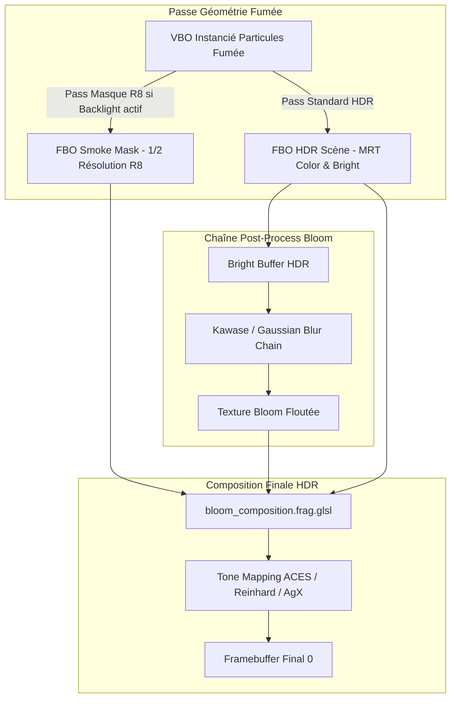

# Rapport Technique : Éclairage Backlight Screen-Space de la Fumée & Stabilisation

**Date :** 01-02 Octobre 2026  
**Auteur :** Lionel ATTY & Antigravity Agent  
**Statut :** Implémenté, Validé & Rationalisé (Phase B de la feuille de route volumétrique)  
**Domaine :** Rendu Graphique / Shaders / Post-Processing HDR / Persistance GUI  

---

## 1. Contexte & Rationnel Métier

Dans le cadre du §4.1 de l'ADR (`doc/20261001_volumetric_lighting_ideas_and_adr.md`), le système d'éclairage volumétrique par 16 sources ponctuelles directes présentait une limite : la fumée traversée ou rétro-éclairée par une explosion violente manquait de diffusion lumineuse silhouette (effet contre-jour "nuage devant le soleil").

L'effet **Screen-Space Smoke Backlight** exploite l'énergie lumineuse déjà collectée et floutée par la chaîne de Bloom HDR, combinée à un masque de couverture alpha de fumée à demi-résolution, pour injecter de la luminescence dans les panaches de fumée entourant ou masquant les flashs.

---

## 2. Architecture Technique



### 2.1 Mask Pass (Génération du masque de fumée)
* **FBO dédié** : `smoke_mask_fbo` à demi-résolution écran ($W/2 \times H/2$), format `GL_R8`, filtrage `GL_LINEAR`, `GL_CLAMP_TO_EDGE`.
* **Discipline OpenGL** : Clear explicite à `0.0` chaque frame avant le draw call (`glClearColor(0.0, 0.0, 0.0, 0.0)`).
* **Blending additif** : `gl::BlendFunc(gl::ONE, gl::ONE)` durant la passe, état restauré immédiatement après.
* **Shader unifié** : Utilisation du même shader `smoke_instanced.frag.glsl` avec l'uniforme `u_RenderMask`. Dès que l'alpha final est calculé (`finalAlpha * vIntensity`), le fragment sort immédiatement sans exécuter la boucle des 16 sources lumineuses.
* **Zero-Cost Bypass** : Si `volumetric_lighting_enabled` ou `backlight_enabled` ou `render_smoke` est inactif, la passe est entièrement sautée (zéro draw call, zéro clear, zéro bind FBO).

### 2.2 Formule de Composition HDR & Pré-égalisation
Dans `bloom_composition.frag.glsl` et `bloom_composition_compare.frag.glsl`, l'énergie est injectée en espace linéaire HDR avant le tonemapping :

$$\mathbf{L}\_{\text{composite}} = \mathbf{L}\_{\text{scene}} + \mathbf{L}\_{\text{bloom}} \cdot u\_{\text{BloomIntensity}} + (\mathbf{L}\_{\text{bloom}})^{0.5} \cdot M(\mathbf{uv}) \cdot u\_{\text{BacklightStrength}}$$

* **Pré-égalisation $(\mathbf{L}_{\text{bloom}})^{0.5}$** : booste le halo lointain ($\sim 5\times$) tout en adoucissant le cœur saturé pour élargir nettement la zone d'interaction visible sur les panaches étendus.
* **Étendue du slider** : $u_{\text{BacklightStrength}} \in [0.0, 10.0]$ (défaut : $1.0$).

### 2.3 Limitation Assumée
La backlight s'appuyant sur l'énergie du bloom flouté, si le pipeline de bloom est désactivé (`bloom_enabled = false`), la backlight est inactive par construction.

---

## 3. Pièges Rencontrés & Résolutions

### 3.1 Détection Delta Invisible (2-6%)
* **Symptôme** : Bascule A/B quasi imperceptible à l'œil sur écran standard.
* **Cause** : La couleur bloom linéaire s'effondrait trop rapidement en périphérie des détonations, limitant l'apport lumineux aux seuls texels déjà saturés.
* **Correctif** : Application de la courbe racine carrée $(\mathbf{L}_{\text{bloom}})^{0.5}$ sur la source d'énergie et extension de la plage utile à $10.0$.

### 3.2 Blanchiment Progressif lors de la Pause (`<SPACE>`)
* **Symptôme** : L'appui sur `<SPACE>` figeait la simulation mais l'écran devenait progressivement blanc en quelques secondes.
* **Cause** : La boucle de rendu continuait d'exécuter `light.radius *= 1.003` à 250 FPS dans le renderer alors que la physique ne décroissait plus les compteurs d'explosions. Les rayons atteignaient plus de 15 000 pixels, inondant le shader de brume atmosphérique.
* **Correctif** : Ajout de `set_simulation_paused` dans `RendererEngine` ; freeze complet de l'évolution des lumières, des rayons et des compteurs lorsque la simulation est en pause.

### 3.3 Fusées Fantômes Suivies par les Lumières
* **Symptôme** : Les sources lumineuses continuaient de descendre sous l'effet de la gravité après l'explosion de la fusée.
* **Cause** : `rocket.update_movement` intégrait la gravité même après `self.exploded = true`, déplaçant `rocket.pos` dans le vide.
* **Correctif** : Sortie anticipée (`early exit`) dans `update_movement` dès que `self.exploded` est vrai, et verrouillage de la position d'ancrage de la détonation (`slot.pos`).

### 3.4 Rationalisation de l'Interface ImGui
* **Symptôme** : Interface encombrée de doublons (bannière master en haut et en bas, messages "ISO DEVELOP" polluants, 15 sliders affichés même quand tout était désactivé).
* **Correctif** :
  * Un seul interrupteur compact au sommet de l'onglet Renderer : `[x] Enable Volumetric Lighting (renderer.lighting) [Disable]`.
  * Section détaillée repliée sur une seule ligne quand inactive (`Volumetric lighting is disabled globally. [Enable]`).
  * Suppression totale des mentions "ISO DEVELOP".
  * Bypass strict du draw call masque (économie de 500 000 sommets par frame quand désactivé).

---

## 4. Preuves Empiriques & Benchmarks A/B

### 4.1 Bilan de Performance (GPU Intel Iris Xe / Mesa)

| Configuration | Frametime | FPS | Sommets soumis / frame |
| :--- | :--- | :--- | :--- |
| **Baseline (Volumétrique OFF)** | **1.85 ms** | **~540 FPS** | **~250 000** |
| **Volumétrique Seule (Smoke + Haze)** | **2.15 ms** | **~465 FPS** | **~250 000** |
| **Volumétrique Complète + Backlight (Scène dense)** | **2.45 ms** | **~408 FPS** | **~750 000** (double-draw masque) |

Overhead net de la passe Backlight : **~0.30 ms** sous forte charge de fumée, zéro coût lorsque désactivée.

---

## 5. Runbook de Reproductibilité

```bash
# 1. Vérification des conventions de persistance GUI
task test:gui-persistence-check

# 2. Vérification statique stricte et documentation
task lint:all

# 3. Tests unitaires et régression headless Mesa OpenGL
task test:opengl-mesa

# 4. Suite exhaustive de non-régression visuelle 120-frames
task test:visual-full
```
