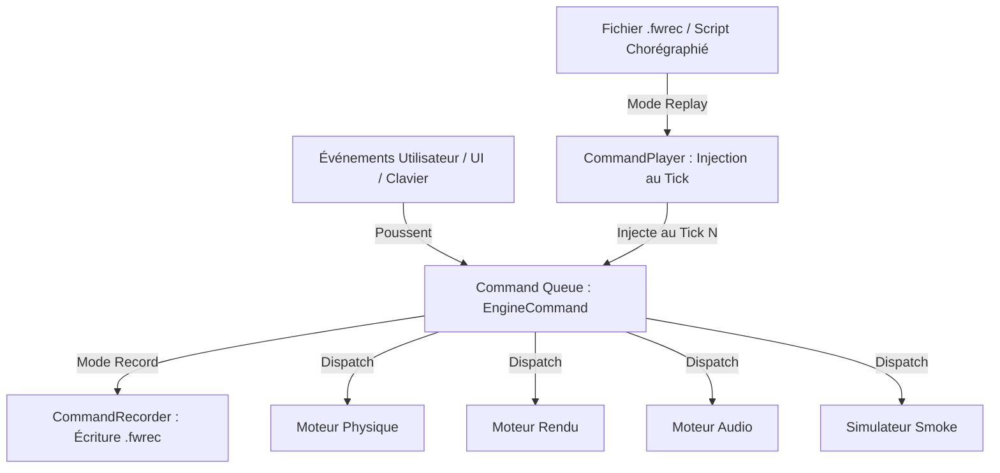

# Spécification Technique & RFC : Mode Record & Replay de Commandes

**Date :** 11 Octobre 2026  
**Auteur :** Lionel ATTY  
**Statut :** RFC / Spécification Prémartiale (TODO Futur Proche)  
**Domaine :** Architecture Transverse, CQRS, Déterminisme & Outils de Simulation  

---

## 1. Vision & Objectifs

Le simulateur de feux d'artifice repose sur une boucle temps réel à haute fréquence combinant physique gravitationnelle (120 Hz fixed timestep), audio spatialisé et rendu OpenGL immersif. 

L'introduction récente de l'**Inversion de Contrôle (IoC)** et de l'architecture CQRS via `src/domain_contracts.rs` centralise l'intégralité des mutations d'état au travers d'un flux unidirectionnel de commandes typées (`EngineCommand`).

Cette spécification définit l'architecture du futur **Mode Record & Replay**, permettant de :
1. **Enregistrer** un flux d'interactions utilisateur (clics, réglages GUI, frappes console, tirs de fusées) dans un fichier compact `.fwrec`.
2. **Rejouer** la séquence avec un **déterminisme bit-à-bit strict**, indépendamment de la machine ou des variations de framerate.
3. **Chorégraphier** des spectacles pyrotechniques préprogrammés synchronisés avec précision.
4. **Alimenter la CI/CD** avec des scénarios de test et des benchmarks A/B 100 % reproductibles (élimination des biais statistiques liés aux manipulations manuelles).

---

## 2. Fondations & Synergie avec `domain_contracts.rs`

Dans la plupart des moteurs de jeu legacy, l'implémentation d'un système de replay est invasive et complexe car les états sont mutés en direct par les callbacks d'événements (souris, clavier, UI).

Dans notre simulateur, le travail de fondation est déjà achevé :
* **Unification des Commandes :** L'énumération `EngineCommand` unifie toutes les intentions :
  * `PhysicCommand` (gravité, forces, dispersion, formes de bouquets, capacité).
  * `SmokeCommand` (densité, érosion, dissipation, vent, couleur).
  * `RendererCommand` (bloom, exposition, haze, backlight, tonemapping).
  * `AudioCommand` (volume maître, reverb, spatialisation, activation des effets DSP).
  * `GuiCommand` (pause, session, rocket cursor).
* **Point de convergence unique :** Dans `Simulator`, toutes les commandes sont émises dans une file continue `cmd_queue: Vec<EngineCommand>`.
* **Zero-Allocation :** Les commandes sont des types valeur `Copy` ou `Clone` de petite taille, idéales pour l'enregistrement en flux continu à faible empreinte mémoire.

---

## 3. Cas d'Usage Majeurs



### A. Spectacles Pyrotechniques Chorégraphiés (Show Design)
Permet à un utilisateur ou créateur de programmer un feu d'artifice synchronisé (par exemple sur une piste musicale) en déclenchant des fusées spécifiques à des intervalles millimétrés, avec ajustement dynamique des paramètres de rendu (changement d'ambiance lumineuse, rafales de vent).

### B. Benchmarking A/B & Profiling Rigoureux (Zero-Trust Perf)
Aujourd'hui, comparer l'impact d'une passe de rendu (ex: Karis downsample vs Kawase bloom) nécessite de lancer des fusées à la souris en espérant reproduire une densité de particules comparable.
Avec le mode Replay :
* Rejeu d'un scénario de 1200 ticks (10 secondes) avec 50 000 particules.
* Mesure Criterion ou Tracy rigoureuse sur une charge **rigoureusement identique**.

### C. Non-Régression Graphique & CI/CD
Exécution du simulateur en mode headless (`task test:visual-full`) pilotée par un fichier replay de référence, garantissant que chaque frame générée peut être comparée au pixel près avec une golden image.

### D. Triage et Reproduction de Bugs
Lorsqu'un utilisateur rencontre un artefact visuel ou un plantage physique, il partage simplement son fichier `.fwrec` (quelques kilo-octets) permettant aux développeurs de reproduire le bogue à la frame exacte.

---

## 4. Modèle de Données & Format de Fichier `.fwrec`

Le format de fichier `.fwrec` (Fireworks Recording) est composé d'un en-tête de session et d'une séquence d'événements horodatés.

### A. En-tête de Replay (`ReplayHeader`)

```rust
use serde::{Deserialize, Serialize};

#[derive(Debug, Clone, Serialize, Deserialize)]
pub struct ReplayHeader {
    /// Version du format de fichier (garantie de compatibilité).
    pub format_version: u32,
    /// Seed initiale du générateur pseudo-aléatoire (PRNG).
    pub prng_seed: u64,
    /// Fréquence de tick de la simulation physique (ex: 120 Hz).
    pub fixed_timestep_hz: u32,
    /// Horodatage ISO 8601 de la capture.
    pub recorded_at: String,
    /// Métadonnées optionnelles (titre du show, auteur, description).
    pub title: Option<String>,
    pub author: Option<String>,
}
```

### B. Commande Horodatée (`TimedCommand`)

L'horodatage repose sur le numéro de **tick physique** (`u64`) plutôt que sur une horloge temps réel (`Instant`), immunisant le rejeu contre les variations de vitesse d'exécution de la machine hôte.

```rust
use crate::domain_contracts::EngineCommand;
use serde::{Deserialize, Serialize};

#[derive(Debug, Clone, Serialize, Deserialize)]
pub struct TimedCommand {
    /// Numéro de tick fixe où la commande doit être exécutée.
    pub tick: u64,
    /// La commande typée à injecter.
    pub command: EngineCommand,
}
```

### C. Structure Racine (`ReplayTrack`)

```rust
#[derive(Debug, Clone, Serialize, Deserialize)]
pub struct ReplayTrack {
    pub header: ReplayHeader,
    pub events: Vec<TimedCommand>,
}
```

### D. Encodage : Double Format Lisible & Binaire
1. **Format JSON / TOML (`.fwrec.json`) :**
   * Édition humaine facile (écriture manuelle de chorégraphies).
   * Parfait pour l'inspection et les revues de code Git.
2. **Format Binaire Compact (`.fwrec`) :**
   * Sérialisation binaire via `bincode` ou `postcard`.
   * Enregistrement ultra-rapide sans latence disque ni allocation dynamique volumineuse.

---

## 5. Déterminisme & Gestion de l'Aléa

Pour garantir qu'un replay reproduise la simulation au pixel et au son près, deux conditions sont requises :

### 1. Fixed Timestep (Sub-stepping 120 Hz)
Le moteur physique utilise déjà un pas de temps fixe de 120 Hz (`FIX-01`). Chaque itération intègre les équations du mouvement avec un $dt$ constant ($\frac{1}{120}\text{ s} \approx 8.33\text{ ms}$). Les événements sont appliqués au début du tick correspondant.

### 2. Contrôle de la Graine Pseudo-Aléatoire (PRNG Seed)
* Le moteur physique utilise un PRNG pour l'angle d'éjection des particules, la vitesse initiale des fusées et leurs couleurs.
* **Enregistrement :** Au démarrage de la session, le `prng_seed` initial est extrait et stocké dans `ReplayHeader`.
* **Rejeu :** À l'initialisation du `CommandPlayer`, le PRNG est réinitialisé avec ce même `seed`.
* **Résultat :** Toutes les trajectoires, explosions et retombées de particules sont rigoureusement identiques entre l'enregistrement et le rejeu.

---

## 6. Architecture d'Interception & Injection (Zero-Cost)

L'implémentation s'insère de manière transparente dans `src/simulator.rs` :

```rust
pub struct CommandRecorder {
    recording: bool,
    current_tick: u64,
    track: ReplayTrack,
}

impl CommandRecorder {
    pub fn record_frame(&mut self, commands: &[EngineCommand]) {
        if !self.recording {
            return;
        }
        for cmd in commands {
            self.track.events.push(TimedCommand {
                tick: self.current_tick,
                command: *cmd,
            });
        }
        self.current_tick += 1;
    }
}
```

```rust
pub struct CommandPlayer {
    playing: bool,
    current_tick: u64,
    cursor: usize,
    track: ReplayTrack,
}

impl CommandPlayer {
    pub fn advance_frame(&mut self, out_commands: &mut Vec<EngineCommand>) {
        if !self.playing {
            return;
        }
        while self.cursor < self.track.events.len() {
            let event = &self.track.events[self.cursor];
            if event.tick == self.current_tick {
                out_commands.push(event.command);
                self.cursor += 1;
            } else if event.tick > self.current_tick {
                break;
            } else {
                self.cursor += 1;
            }
        }
        self.current_tick += 1;
    }
}
```

**Zéro intrusion dans les moteurs :** Les sous-systèmes (Physique, Rendu, Audio) continuent de consommer `EngineCommand` sans avoir conscience du mode en cours (interactif, enregistrement ou rejeu).

---

## 7. Interface Utilisateur & Intégration CLI

### A. Ligne de Commande (CLI)

```bash
# Enregistrer une session interactive dans un fichier
cargo run --release -- --record show_2026.fwrec

# Rejouer une session à vitesse normale
cargo run --release -- --replay show_2026.fwrec

# Exécuter en mode headless déterministe pour benchmark ou validation visuelle
cargo run --release -- --headless --replay show_2026.fwrec --frames 1200
```

### B. Contrôles ImGui (Replay Player Bar)
Une barre d'outils dédiée intégrée à l'UI :
* **Bouton Record (🔴) :** Démarre/arrête l'enregistrement.
* **Bouton Play / Pause (▶️ / ⏸️) :** Contrôle de la lecture.
* **Scrubber / Timeline :** Curseur permettant de visualiser l'avancement dans le show et de se repérer parmi les keyframes d'explosions.

---

## 8. Feuille de Route d'Implémentation (Roadmap Phasing)

| Phase | Intitulé | Tâches Techniques | Impact Fichiers |
|---|---|---|---|
| **Phase 1** | **Sérialisation des Contrats** | Ajouter `#[derive(Serialize, Deserialize)]` sur `EngineCommand`, `PhysicCommand`, `RendererCommand`, `AudioCommand`, `SmokeCommand`, `GuiCommand` et leurs types associés dans `domain_contracts.rs`. | `src/domain_contracts.rs` |
| **Phase 2** | **Module `replay` & Structures** | Création de `src/replay/mod.rs`, `ReplayHeader`, `TimedCommand`, `ReplayTrack`, lecture/écriture binaire (`bincode`) et JSON. | `src/replay/*`, `Cargo.toml` |
| **Phase 3** | **Injection dans `Simulator`** | Intégration de `CommandRecorder` et `CommandPlayer` dans la boucle de simulation principale (`src/simulator.rs`). | `src/simulator.rs` |
| **Phase 4** | **Flags CLI & Commandes Console** | Ajout des options `--record` et `--replay` dans Clap, et des commandes console `record start`, `record stop`, `replay <fichier>`. | `src/main.rs`, `src/utils/command_console/*` |
| **Phase 5** | **Widget ImGui Timeline** | Conception du panneau de contrôle de replay dans l'interface ImGui avec scrubber et indicateurs de timeline. | `src/simulator/gui_settings/*` |
