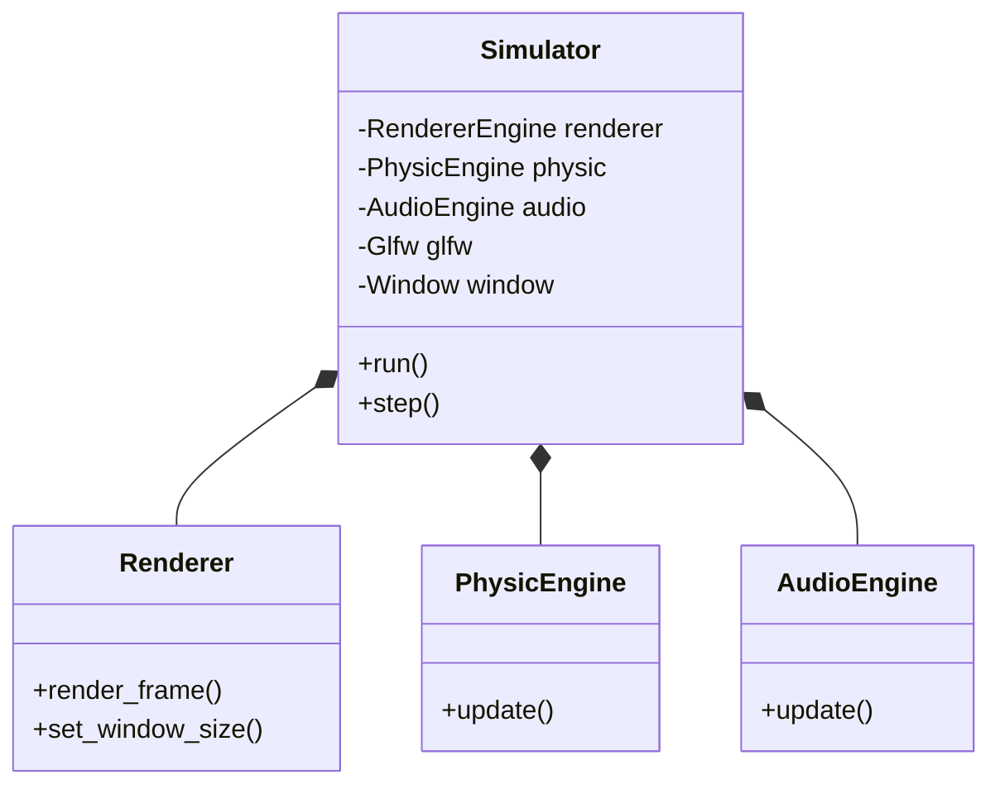
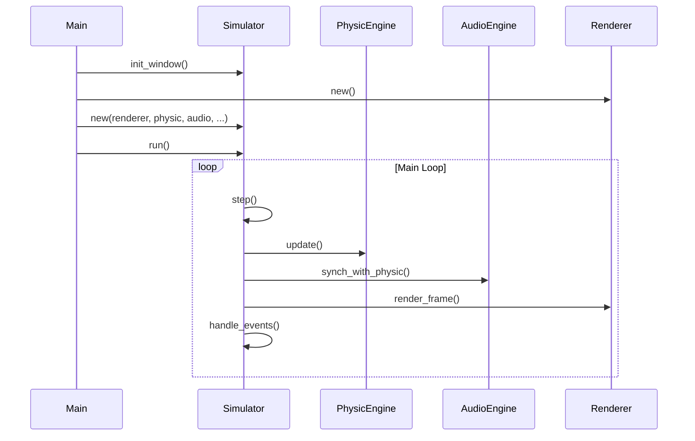

# Architecture Redesign: Simulator Orchestration

## Overview
This document describes the architectural refactoring that decouples the rendering logic from the simulation orchestration. The goal is to separate responsibilities, making the `Renderer` a pure rendering service and the `Simulator` the central orchestrator of the application lifecycle.

## Key Changes

### 1. Simulator as Orchestrator
The `Simulator` struct now owns the main application loop and manages the lifecycle of all subsystems.
- **Responsibilities**:
    - Window creation and event handling (via `glfw`).
    - Main loop execution (`run` and `step` methods).
    - Coordination of `PhysicEngine`, `AudioEngine`, and `RendererEngine`.
    - User input processing and console command management.

### 2. Renderer Simplification
The `Renderer` has been stripped of non-rendering logic.
- **Responsibilities**:
    - Initializing OpenGL resources (buffers, shaders).
    - Rendering a single frame upon request (`render_frame`).
    - Handling window resize events for the viewport.
- **Removed**:
    - Window creation (now in `Simulator::init_window`).
    - Main loop control.
    - Input polling.

## Architecture Diagrams

### Component Relationships

### Execution Flow (Main Loop)

